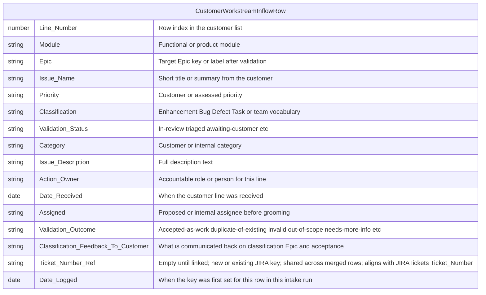

# Customer workstream inflow (CustomerWorkstreamInflowRow)

Logical **`CustomerWorkstreamInflowRow`** table: one row per line on a **customer-provided issue list** processed by [Customer-facing workstream inflow validation workflow](../processes/workflows/customer-facing-workstream-inflow-validation-workflow.md). This is **upstream** of the **`JIRATickets`** mirror in [work-items.md](work-items.md): when an item is accepted as work and a JIRA issue is created, **`Ticket_Number_Ref`** aligns with **`Ticket_Number`** in that schema.

**Dual outcomes per row:** (1) **`Classification_Feedback_To_Customer`** — text suitable to return to the customer (classification, Epic, acceptance or rejection rationale). (2) **`Ticket_Number_Ref`** and **`Date_Logged`** — the **authoritative JIRA key** for tracked work (**new or pre-existing** issue). **Multiple rows** may share the **same** **`Ticket_Number_Ref`** when several customer lines are **merged** into one ticket, or when an **existing** issue already covers the request. Rows with a key populated are the usual input slice for [Workstream inflow ticket grooming workflow](../processes/workflows/workstream-inflow-ticket-grooming-workflow.md).

