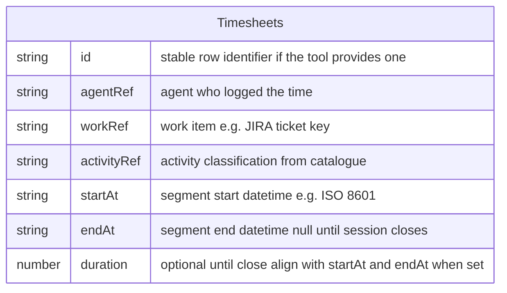

# Timesheets

Canonical `erDiagram` for the logical **`Timesheets`** table: one row per [Time Entry](../entities/time-entry.md) segment. **Many rows may share the same `workRef`.** Rows follow the [Main workflow](../processes/main-workflow.md): **`startAt`** is set when the segment **opens**; **`endAt` is null** while work is in progress; **`endAt`** (and **`duration`** if stored) are set when the session **closes**. Completed rows used for reporting must have **`endAt` populated**.

