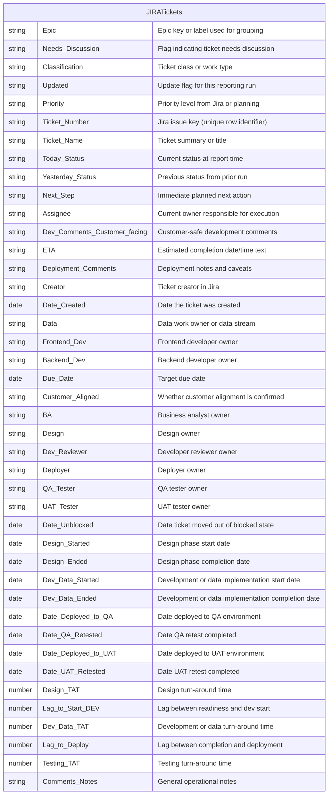

# Work items (JIRATickets)

Canonical `erDiagram` for the logical **`JIRATickets`** table (Excel `JIRA` sheet). Each row aligns with one JIRA ticket; `Ticket_Number` is the issue key.

```mermaid
erDiagram
    JIRATickets {
        string Epic "Epic key or label used for grouping"
        string Needs_Discussion "Flag indicating ticket needs discussion"
        string Classification "Ticket class or work type"
        string Updated "Update flag for this reporting run"
        string Priority "Priority level from Jira or planning"
        string Ticket_Number "Jira issue key (unique row identifier)"
        string Ticket_Name "Ticket summary or title"
        string Today_Status "Current status at report time"
        string Yesterday_Status "Previous status from prior run"
        string Next_Step "Immediate planned next action"
        string Assignee "Current owner responsible for execution"
        string Dev_Comments_Customer_facing "Customer-safe development comments"
        string ETA "Estimated completion date/time text"
        string Deployment_Comments "Deployment notes and caveats"
        string Creator "Ticket creator in Jira"
        date Date_Created "Date the ticket was created"
        string Data "Data work owner or data stream"
        string Frontend_Dev "Frontend developer owner"
        string Backend_Dev "Backend developer owner"
        date Due_Date "Target due date"
        string Customer_Aligned "Whether customer alignment is confirmed"
        string BA "Business analyst owner"
        string Design "Design owner"
        string Dev_Reviewer "Developer reviewer owner"
        string Deployer "Deployer owner"
        string QA_Tester "QA tester owner"
        string UAT_Tester "UAT tester owner"
        date Date_Unblocked "Date ticket moved out of blocked state"
        date Design_Started "Design phase start date"
        date Design_Ended "Design phase completion date"
        date Dev_Data_Started "Development or data implementation start date"
        date Dev_Data_Ended "Development or data implementation completion date"
        date Date_Deployed_to_QA "Date deployed to QA environment"
        date Date_QA_Retested "Date QA retest completed"
        date Date_Deployed_to_UAT "Date deployed to UAT environment"
        date Date_UAT_Retested "Date UAT retest completed"
        number Design_TAT "Design turn-around time"
        number Lag_to_Start_DEV "Lag between readiness and dev start"
        number Dev_Data_TAT "Development or data turn-around time"
        number Lag_to_Deploy "Lag between completion and deployment"
        number Testing_TAT "Testing turn-around time"
        string Comments_Notes "General operational notes"
    }
```
