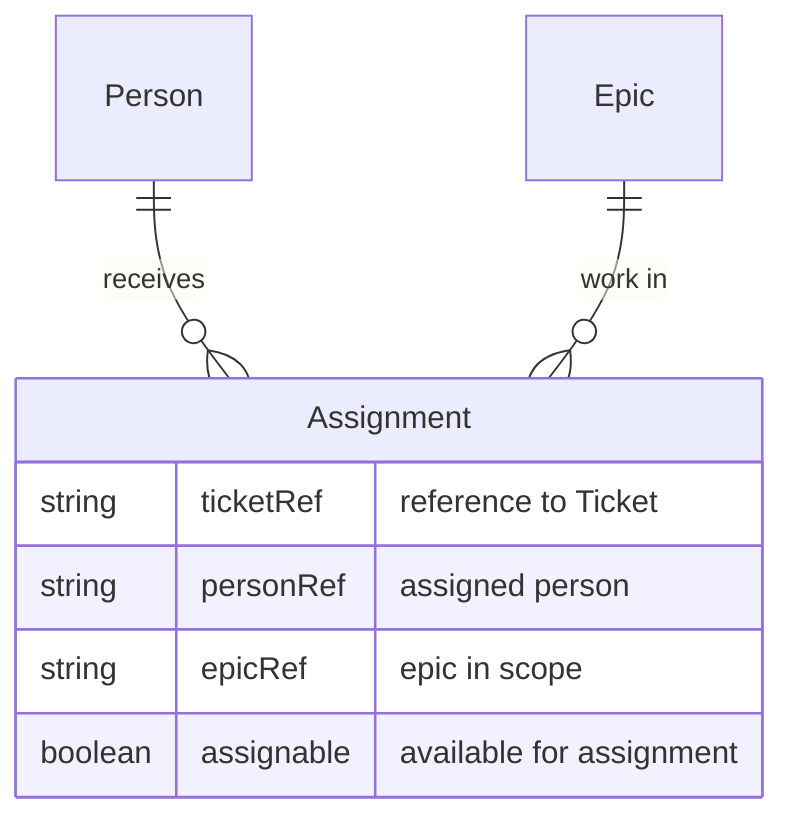

# Assignment

**Assignment** is the link between work (e.g. JIRA [[Entity - Ticket|tickets]] in an [[Entity - Epic|Epic]]) and a [[Entity - Person|Person]] who can do it. A [[Entity - Team|Team]]’s members are Assignable when they are available to be assigned to [[Entity - Ticket|tickets]] within the epics in scope.

## Schema

