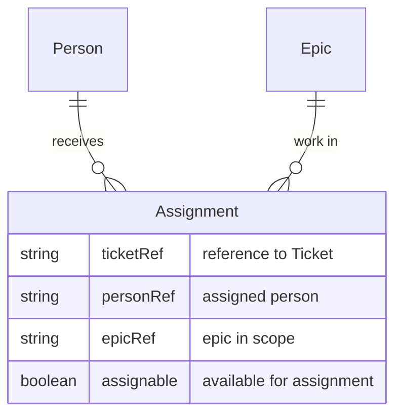

# Assignment

**Assignment** is the link between work (e.g. JIRA [tickets](Entity%20-%20Ticket.md) in an [Epic](Entity%20-%20Epic.md)) and a [Person](Entity%20-%20Person.md) who can do it. A [Team](Entity%20-%20Team.md)’s members are Assignable when they are available to be assigned to [tickets](Entity%20-%20Ticket.md) within the epics in scope.

## Schema

