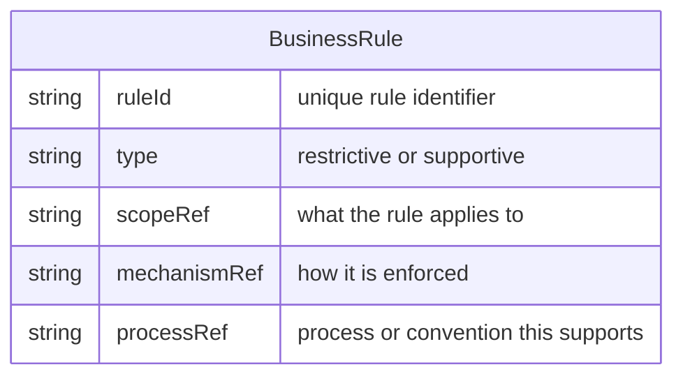

# Business Rule

A **Business Rule** is a constraint or default that supports or enforces how work is done. Rules are either **restrictive** (they block actions that break the rule, e.g. prevent force-push to a protected branch or deletion of a critical resource) or **supportive** (they provide defaults, auto-selection, or automatic behaviour that a [Person](Entity%20-%20Person.md) can override when there are legitimate exceptions). A rule has a scope (what it applies to—e.g. repository, branch, ticket type) and a mechanism (how it is enforced—e.g. Git hook, CI job, tool setting). Business rules are used to reliably deploy and enforce [Process](Entity%20-%20Process.md)es so that key behaviours do not depend on memory or discipline alone.

## Schema

