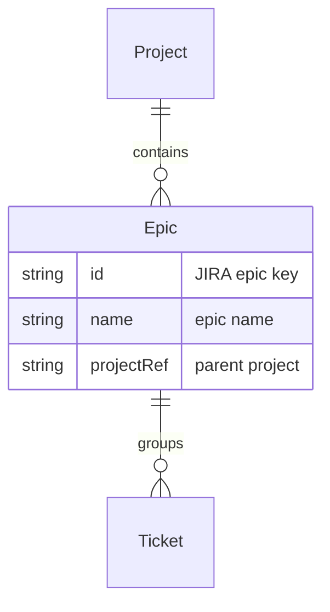

# Epic

An **Epic** in JIRA groups related work. There are 1–many Epics per [[Entity - Project|Project]]. [[Entity - Ticket|Tickets]] in an Epic can be reflected in an Excel table (e.g. on a JIRA sheet).

## Schema

The *Ticket* in the diagram refers to the [[Entity - Ticket|Ticket]] entity.
