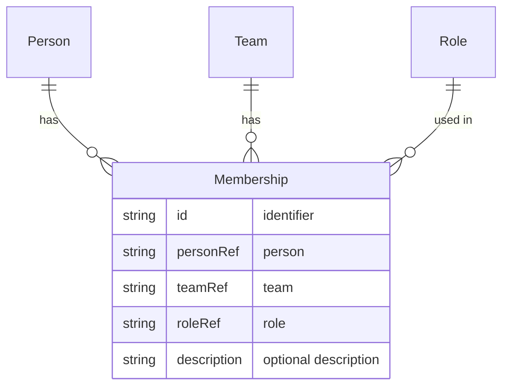

# Membership

A **Membership** links a [[Entity - Person|Person]] to a [[Entity - Team|Team]] with a specific [[Entity - Role|Role]] and an optional description. It represents that a person is part of a team in a given capacity.

## Schema

