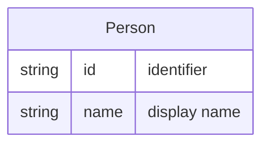

# Person

A **Person** is a worker who can be [Assignable](Entity%20-%20Assignment.md) to [Tickets](Entity%20-%20Ticket.md). A Person may run processes that use centralized workbooks (e.g. from SharePoint). A Person’s association with a [Team](Entity%20-%20Team.md) is expressed through [Membership](Entity%20-%20Membership.md).

## Schema

