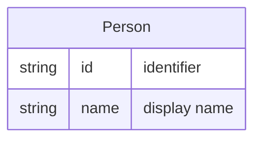

# Person

A **Person** is a worker who can be [[Entity - Assignment|Assignable]] to [[Entity - Ticket|Tickets]]. A Person may run processes that use centralized workbooks (e.g. from SharePoint). A Person’s association with a [[Entity - Team|Team]] is expressed through [[Entity - Membership|Membership]].

## Schema

