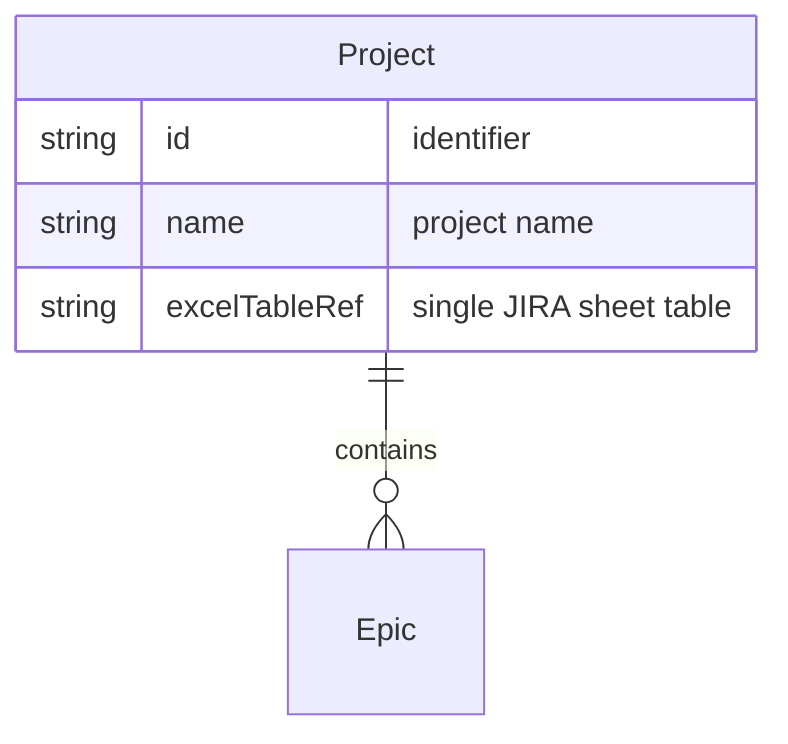

# Project

A **Project** is the scope for Epics and the single Excel table. One table in Excel manages all work items across all [[Entity - Epic|Epics]] within a Project.

## Schema

```mermaid
erDiagram
    Project ||--o{ Epic : "contains"
    Project {
        string id "identifier"
        string name "project name"
        string excelTableRef "single JIRA sheet table"
    }
```
