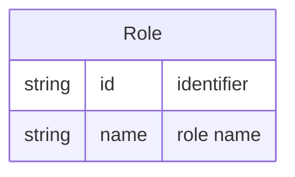

# Role

A **Role** is a named function or responsibility that a [Person](Entity%20-%20Person.md) can hold within a [Team](Entity%20-%20Team.md) via [Membership](Entity%20-%20Membership.md) (e.g. Lead, Developer, Reviewer).

## Schema

