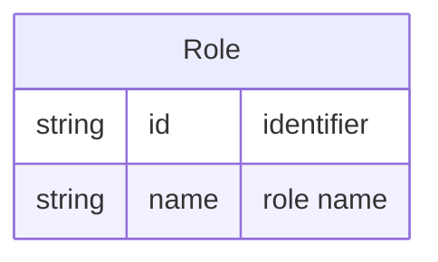

# Role

A **Role** is a named function or responsibility that a [[Entity - Person|Person]] can hold within a [[Entity - Team|Team]] via [[Entity - Membership|Membership]] (e.g. Lead, Developer, Reviewer).

## Schema

