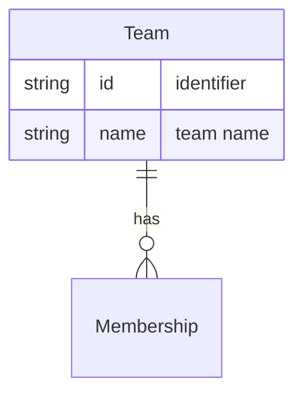

# Team

A **Team** is a grouping of [People](Entity%20-%20Person.md) who work together, linked via [Membership](Entity%20-%20Membership.md). A Team is agnostic to any particular [Project](Entity%20-%20Project.md); its members may be [Assignable](Entity%20-%20Assignment.md) to work within a set of [Epics](Entity%20-%20Epic.md) when a project is in scope.

## Schema

