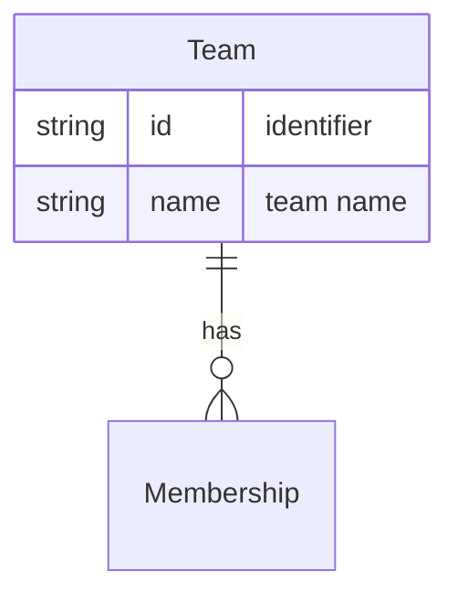

# Team

A **Team** is a grouping of [[Entity - Person|People]] who work together, linked via [[Entity - Membership|Membership]]. A Team is agnostic to any particular [[Entity - Project|Project]]; its members may be [[Entity - Assignment|Assignable]] to work within a set of [[Entity - Epic|Epics]] when a project is in scope.

## Schema

