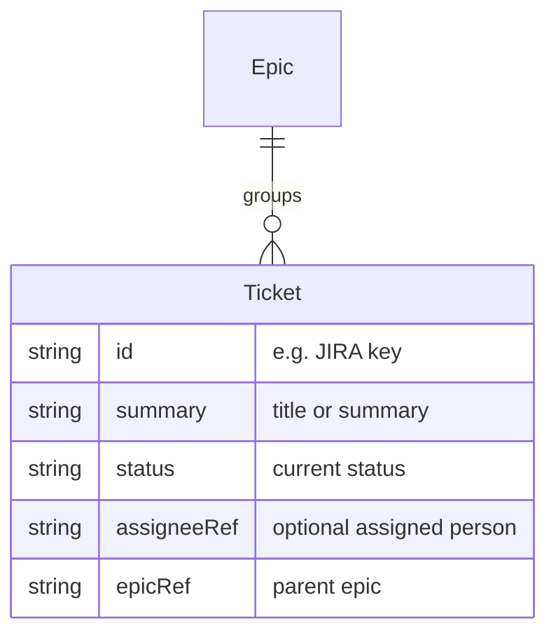

# Ticket

A **Ticket** is a work item (e.g. in JIRA) that represents a unit of work. It is grouped under an [Epic](Entity%20-%20Epic.md) and can be linked to a [Person](Entity%20-%20Person.md) via an [Assignment](Entity%20-%20Assignment.md).

## Schema

