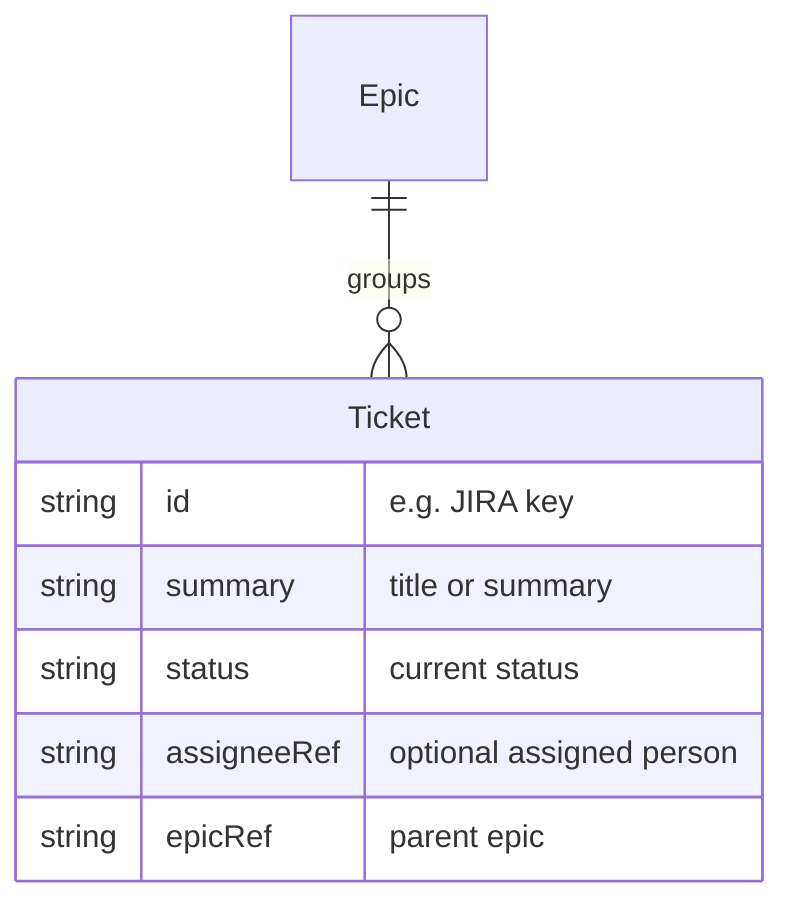

# Ticket

A **Ticket** is a work item (e.g. in JIRA) that represents a unit of work. It is grouped under an [[Entity - Epic|Epic]] and can be linked to a [[Entity - Person|Person]] via an [[Entity - Assignment|Assignment]].

## Schema

