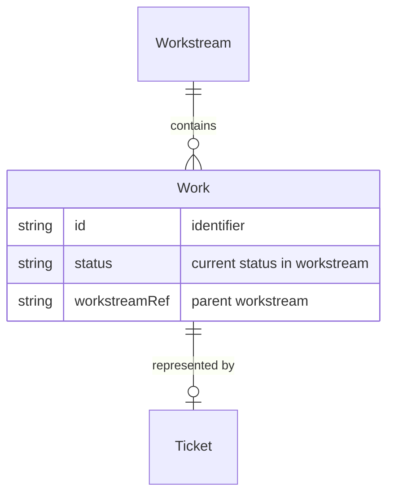

# Work

**Work** is a unit of work that flows through a [Workstream](Entity%20-%20Workstream.md). It is often represented by a [Ticket](Entity%20-%20Ticket.md) in JIRA (or similar tool). The lifecycle of Work within a Workstream is defined by status transitions, each driven by a [Process](Entity%20-%20Process.md).

## Schema

