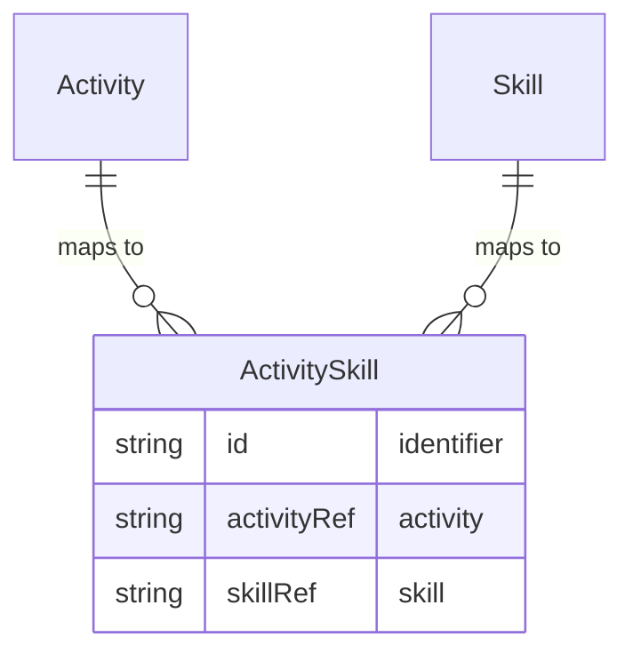

# Activity–Skill

**Activity–Skill** is the mapping between an [Activity](activity.md) and a [Skill](skill.md). An activity may require or utilise one or more skills; a skill may be associated with one or more activities. This mapping allows demand for activities (e.g. from time and activity reporting) to be translated into demand for skills for talent pipeline and capacity planning.

## Schema

