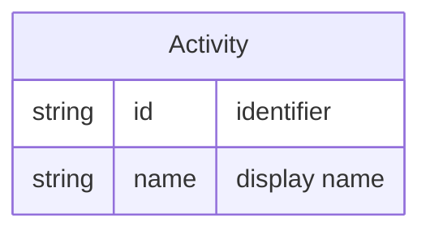

# Activity

An **Activity** is a category or type of work (e.g. development, QA, design). It is used to classify where time is spent when a [Person](person.md) logs time against [Work](work.md), and can be mapped to one or more [Skill](skill.md)s for talent and capacity insights.

## Schema

