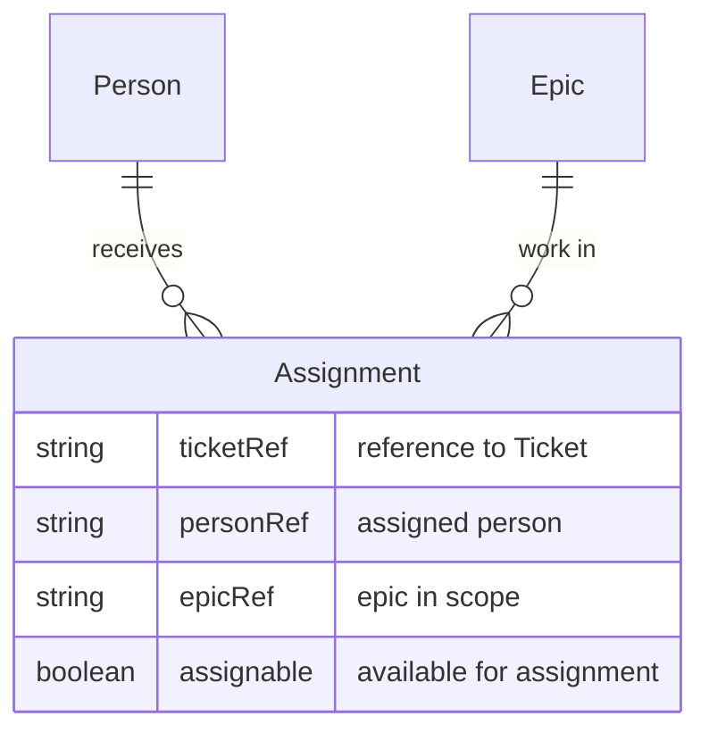

# Assignment

**Assignment** is the link between work (e.g. JIRA [tickets](ticket.md) in an [Epic](epic.md)) and a [Person](person.md) who can do it. A [Team](team.md)'s members are Assignable when they are available to be assigned to [tickets](ticket.md) within the epics in scope.

## Schema

