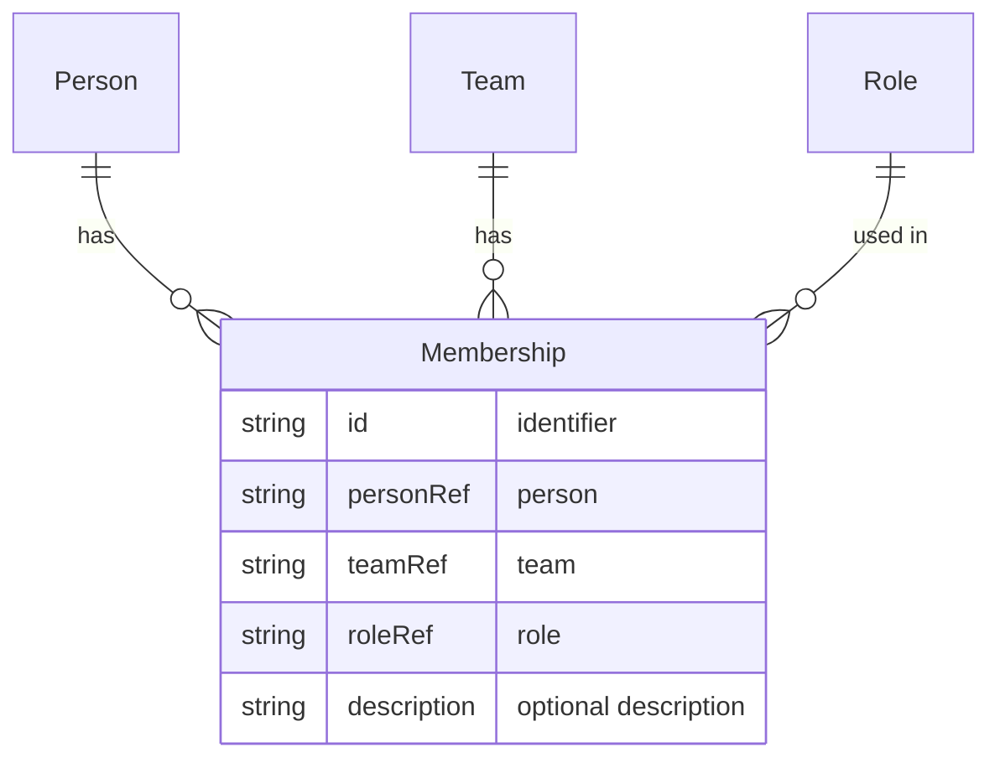

# Membership

A **Membership** links a [Person](person.md) to a [Team](team.md) with a specific [Role](role.md) and an optional description. It represents that a person is part of a team in a given capacity.

## Schema

