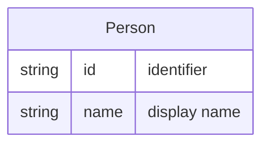

# Person

A **Person** is a worker who can be [Assignable](assignment.md) to [Tickets](ticket.md). A Person may run processes that use centralized workbooks (e.g. from SharePoint). A Person's association with a [Team](team.md) is expressed through [Membership](membership.md).

## Schema

