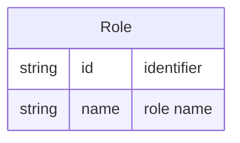

# Role

A **Role** is a named function or responsibility that a [Person](person.md) can hold within a [Team](team.md) via [Membership](membership.md) (e.g. Lead, Developer, Reviewer).

## Schema

```mermaid
erDiagram
    Role {
        string id "identifier"
        string name "role name"
    }
```
