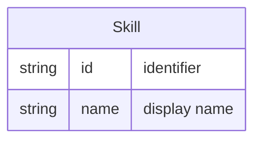

# Skill

A **Skill** is a capability (e.g. Python, UX design) that can be associated with one or more [Activity](activity.md) types. Mapping activities to skills allows demand for activities to be translated into demand for skills, supporting talent pipeline and capacity planning.

## Schema

