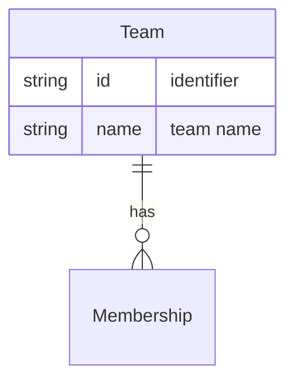

# Team

A **Team** is a grouping of [People](person.md) who work together, linked via [Membership](membership.md). A Team is agnostic to any particular [Project](project.md); its members may be [Assignable](assignment.md) to work within a set of [Epics](epic.md) when a project is in scope.

## Schema

