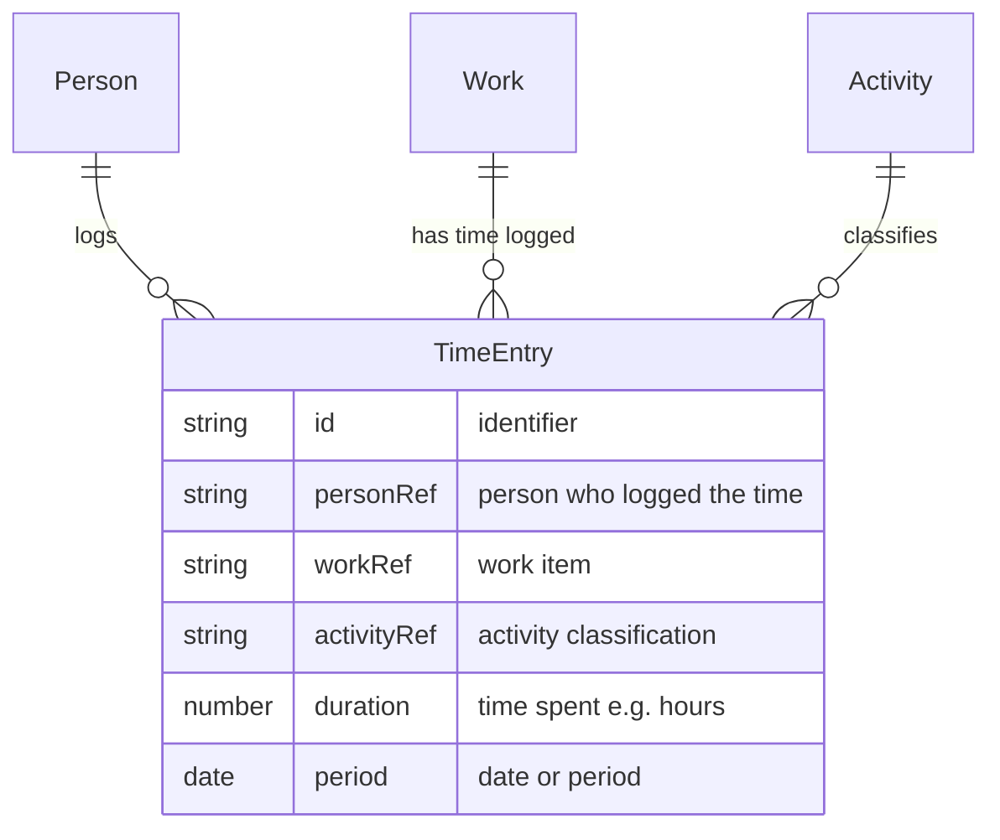

# Time Entry

A **Time Entry** records time spent by a [Person](person.md) on a unit of [Work](work.md), classified by an [Activity](activity.md). It has a duration and a period (e.g. date or week). Time entries enable "time against work" tracking and support capacity and activity concentration reporting.

## Schema

