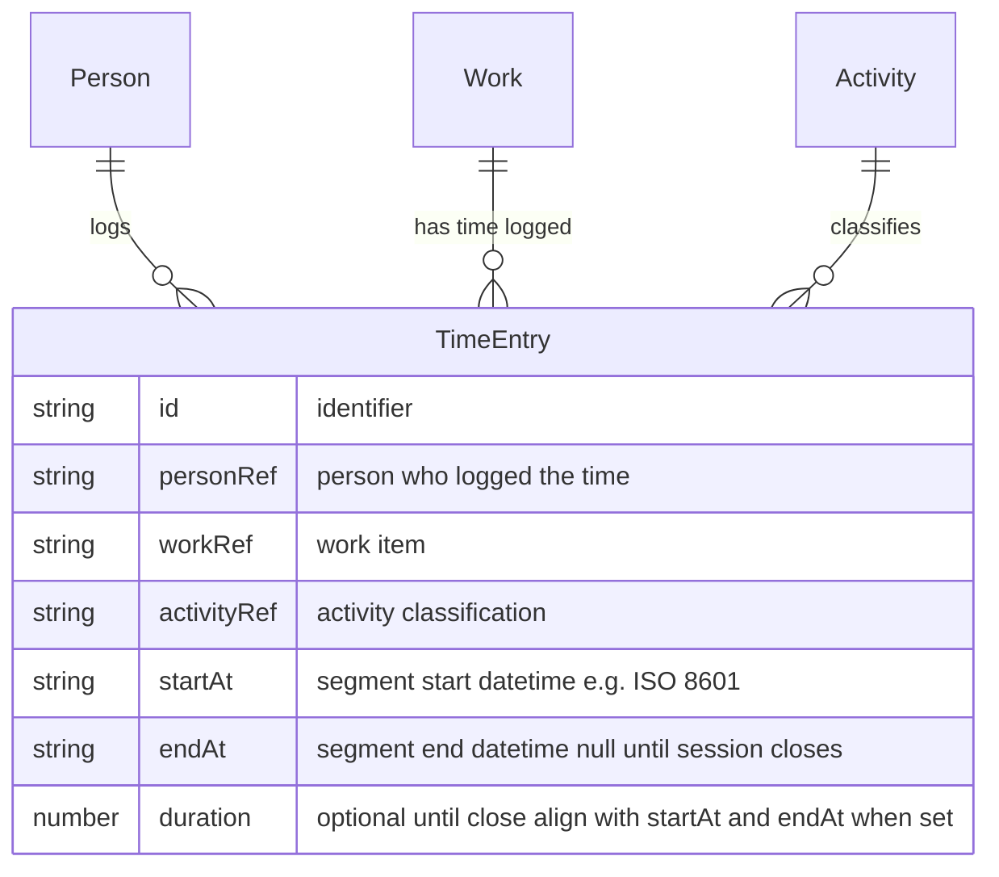

# Time Entry

A **Time Entry** records time spent by a [Person](person.md) on a unit of [Work](work.md), classified by an [Activity](activity.md). In the [Main workflow](../processes/main-workflow.md) model, a row **opens** with **start** datetime set and **`endAt` null** while work runs, then **closes** with **`endAt`** (and usually **duration**) set when the session ends—whether the underlying work finished or not. Many entries may refer to the same work item. Time entries support capacity and activity concentration reporting when intervals are **closed** (`endAt` set).

## Schema

