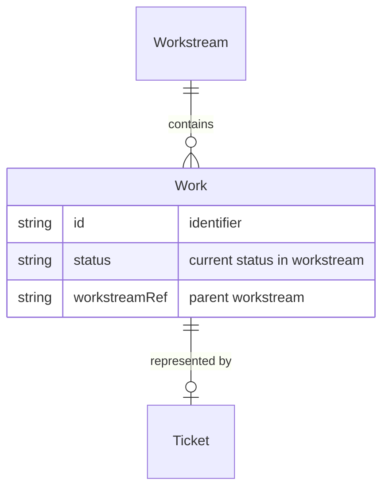

# Work

**Work** is a unit of work that flows through a [Workstream](workstream.md). It is often represented by a [Ticket](ticket.md) in JIRA (or similar tool). The lifecycle of Work within a Workstream is defined by status transitions, each driven by a [Process](process.md).

## Schema

