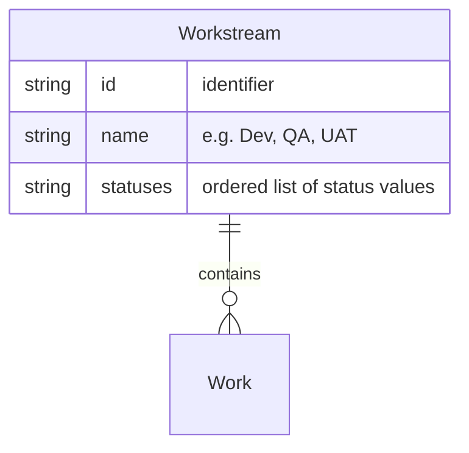

# Workstream

A **Workstream** is a stream of work with defined statuses and transitions (e.g. development, QA, UAT). [Work](work.md) items flow through it; each transition from one status to the next is typically triggered by a [Process](process.md). A company may operate multiple workstreams (e.g. one for new feature development, one for QA findings, one for UAT requests).

## Schema

