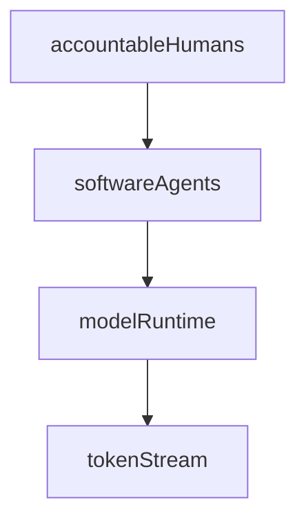

**Intended audience.** People designing agent-heavy operating models: technology and enterprise architects, engineering and product leadership, governance owners, and anyone defining how repositories and workflows should fit together. This note extends [agentic architecture as repository and workflows](./05-agentic-architecture-as-repo-and-workflows.md) with explicit **governance layers** for what agents may load and who remains accountable; companion principles continue the same line of reasoning into **operational regimes**, **records of work**, and **economics and lineage**—see the numbered path in [PRINCIPLES.md](../PRINCIPLES.md). It is not a substitute for concrete schemas or vendor choices.

> [!NOTE]
>
> **Production.** Ideas and first draft are human in origin. Editing (structure, wording, and readability) was done with AI assistance and then proofread and accepted by a human. References were researched, selected, and inserted with AI help; treat the bibliography as a working list and verify citations for any formal or legal use.

This note is a **principle** essay: it argues for a way to think and govern. Operational “how” documents belong under `processes/` and follow process-note conventions described in [processes/README.md](../processes/README.md), which differ from the shape defined in [the principles README](./README.md).[^1]

# 1 Introduction

Coordinated human and software agency fails when knowledge is scattered, access is vague, and nobody can say what the organization has actually **committed to** versus what was merely **generated** or **done**. This principle treats the repository as a **knowledge base for a team of agents** and argues for two foundations before you tune schedules, ledgers, or branch diagrams: **information architecture** at organization and team scale, and a **written governance stack** that tells every agent what applies and what must never be assumed from model output alone.

It builds on [agentic architecture as repository and workflows](./05-agentic-architecture-as-repo-and-workflows.md), which already proposes shared context and explicit workflows. Here the emphasis shifts to **partitioning and risk**, **who orchestrates whom** (humans, agents, models, tokens), and the **constitution → policies → identities → workflows** ladder that turns vague “AI help” into reviewable obligations. Companion principles in the same reading path (steps 7–8 in [PRINCIPLES.md](../PRINCIPLES.md)) carry the story into **operational regimes**, **records of work**, and **economics, lineage, and context isolation**; this file is written so you can read it on its own and still get a complete governance-of-IA argument.

When software agents share work with people, coordination problems stop being only social. They become problems of **where knowledge lives**, **who may change it**, **how activity is authorized**, and **how costs and outcomes are traced**. The sections that follow unpack IA at two scales, the orchestration stack and three kinds of knowledge, the written stack in detail, and where accountable humans must remain in the loop.

Key takeaways

- **Own IA at two scales**: inter-repository layout partitions org risk and context; intra-repository layout keeps shared memory legible—both deserve explicit owners, not accidental folders.
- **Stack roles deliberately**: accountable humans delegate to software agents; agents invoke model runs; **tokens** are **quantization** of **recorded knowledge**, not automatic **authoritative** obligation until you design otherwise.
- **Separate three knowledges**: **recorded** (artifacts and persisted text), **applied** (what workflows change in the world), **authoritative** (what the org commits to)—and keep **intra-workflow** autonomy explicitly bounded.
- **Write the ladder**: **constitution** first, then **policies**, **identities**, and **workflows** that specialize—not replace—the constitution; policies already define what a serious **record of work** must satisfy.
- **Humans bootstrap and govern**: start from workflows that fit the repository’s mission; reserve human authority for constitution and identity change, regime shifts, and anywhere silent widening of autonomy would hurt.

# 2 Information architecture at two scales

**Inter-repository** architecture answers how the organization partitions knowledge and risk: customer-specific repos versus a central org repo, regulated data separated from public code, or mirrors of human department boundaries. Each partition is a **context boundary**: easier to reason about access and blast radius, harder to keep global consistency without explicit bridges (sync processes, shared libraries, federation, or human “inter-department” communication). Those human-style bridges—steercos, guilds, shared service desks—reduce silo risk but **carry coordination overhead and cost** in their own right; they belong in the same trade space as indexing spend and token use.

**Intra-repository** architecture answers how a single team keeps **shared memory** legible: where standards live, where workflows are defined, where agent-specific material sits, and where project artifacts accumulate. The companion note on [agentic architecture as repository and workflows](./05-agentic-architecture-as-repo-and-workflows.md) suggests a practical layering[^2] (`standards/`, `processes/workflows/`, `agents/<name>/`, `projects/<name>/`, `context/`, `runs/`). That pattern is one instance of intra-repo IA; the principle generalizes to “design the tree on purpose,” not “let folders accrete.”

A repository used this way is the **knowledge base of a team of agents** (human and automated). Context management—what an agent loads before it acts—is then partly a **navigation and indexing** problem. Poor IA raises token cost and error rates; good IA concentrates relevant definitions near the work they govern. A complementary, individual-scale pattern—an LLM incrementally maintaining a linked markdown wiki between raw sources and the user, rather than only retrieving chunks at query time—is described in Karpathy’s *LLM Wiki* gist.[^3]

# 3 Orchestration stack and three kinds of knowledge

A useful orchestration picture stacks roles without pretending they are interchangeable:

- **Accountable humans** set regime, delegate authority, approve high-impact changes, and answer for outcomes. They are not the only actors, but they are the backstop for governance.
- **Software agents** interpret context, choose or invoke workflows and tools, and shape prompts within boundaries defined in **identities** and **workflows**.
- **Model runtime (LLMs)** generates **tokens**: discrete units of text and structure. Persisted tokens are a practical **quantisation** of **recorded knowledge**—they are not yet actions or decisions, only material that can support both.

Three kinds of knowledge help separate concerns:

- **Recorded knowledge** — What is in artifacts, logs, tickets, databases, and version control (including tokens persisted as prose, diffs, or structured records).
- **Applied knowledge** — Actions taken under a workflow: API calls, merges, emails sent, tests run. Application changes the world; recording explains what was done.
- **Authoritative knowledge** — Decisions that set or change obligations: what the constitution means for this case, what shipping means, what risk is accepted. Organizations usually anchor the strongest authority in people or boards, not in unconstrained model output.

Agents may hold **limited authority** through **intraworkflow** decisions—for example, choosing among pre-approved options or routing within a bounded policy tree. Expanding that envelope—especially for amending a **constitution** or **identities**—deserves explicit human attention and audit trails. That aligns with the risk posture described in [business as process—and process as data](./02-business-as-process-and-process-as-data.md): automation inside a process is not an excuse to skip governance.[^4]

# 4 Constitution, policies, identities, and workflows

Written artifacts give agents a stable orientation and give humans a review surface. To start, treat the repository as the **knowledge base of a team of agents**; a **constitution** is written first so it **informs every agent**. Every identity remains **in scope of** the constitution; identities and workflows **specialize** it rather than replace it.

- **Constitution** — The smallest non-negotiable core: purpose, ethical and safety boundaries, decision rights at a high level, and how other artifacts may amend one another. Everything serious should trace back here in principle, even if implementation uses pointers and IDs.
- **Policies** — They **expand** the constitution for named contexts—security, data handling, quality bars, accounting rules, retention—and ground **operational standards**, including what a valid **record of work** must contain and which regulations apply. Policies interpret the constitution for domains and regimes.
- **Identities** — Written **for each agent** (or role): mandate, default workflows, tool permissions, tone, escalation paths, and what the agent must not do alone.
- **Workflows** — Written to inform **activities** (procedures) that must take place; they may be specific or deliberately vague where exploration is required. Workflows **refer to policies** to be conformed to; they can include **decisions**, **actions**, and **token generation**—any type of work—as first-class kinds of steps.

Workflow definitions—and even high-level **repository or organization layout** (an **AI-architected** organization in the narrow sense of “architecture drafted with AI”)—can be produced or refactored with AI assistance. The **core architecture must still be initialized** by accountable humans. For auditability, attach **reasons** to **workflow generation** (or architectural generation), to **decisions**, and to **actions**, not only to narrative summaries. The organization-level habit of writing before debating—argued in [written principles and written debate](./01-written-principles.md)—applies to agent governance too: generate if you must, then **review**, cite, and record those reasons.[^5]

# 5 Human bootstrap and governance authority

Humans should **begin** by authoring **workflows suited to the repository’s purpose**—the concrete mission of that knowledge base—not only abstract ideals. They remain **in the loop** as **governance authority**: approving regime changes (routines, queues, parallelism), expanding autonomy, and especially any amendment to the **constitution** or **identities**. **Careful human attention** belongs anywhere authority could silently widen, even when day-to-day execution is agent-heavy.

# 6 References

[^1]: Principle essays follow [the principles README](./README.md); process notes follow [processes/README.md](../processes/README.md).

[^2]: For repository layout, workflows, and run logging, see [agentic architecture as repository and workflows](./05-agentic-architecture-as-repo-and-workflows.md).

[^3]: Andréj Karpathy, *LLM Wiki* (gist), https://gist.github.com/karpathy/442a6bf555914893e9891c11519de94f

[^4]: For processes as state change, impact versus cost, and governance maturity, see [business as process—and process as data](./02-business-as-process-and-process-as-data.md).

[^5]: For durable written alignment and meetings on top of text, see [written principles and written debate](./01-written-principles.md).
