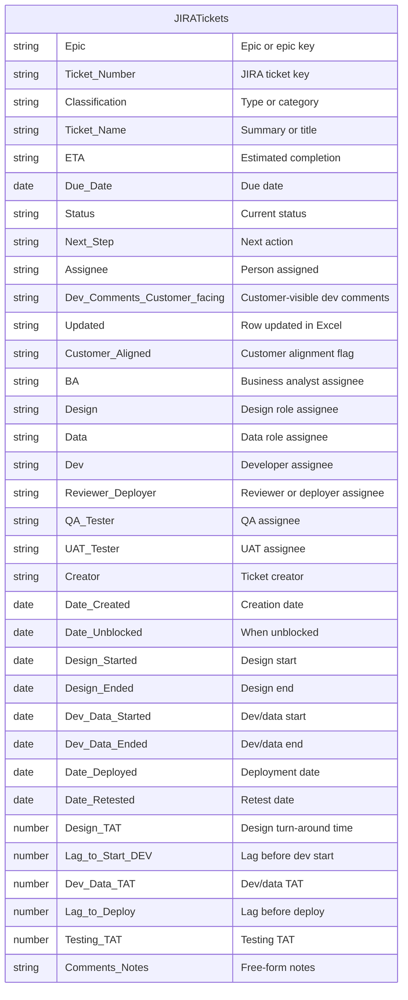

# Periodic Work Management - Task Updates & Alignment across Workers

## Purpose

Keep JIRA [tickets](../entities/ticket.md) and the Excel table (JIRA sheet) in sync: capture new [tickets](../entities/ticket.md), assign them to a [Person](../entities/person.md), comment and update in JIRA, and tick them off in Excel. Outcome: Excel and JIRA stay aligned; every active [ticket](../entities/ticket.md) is assigned and commented.

## Conditions

This process is doable only when:

- A [Project](../entities/project.md) exists in context.
- A [Team](../entities/team.md) exists: a set of [People](../entities/person.md) who are [Assignable](../entities/assignment.md) to work within the set of [Epics](../entities/epic.md) in scope.

## Tools

- [JIRA](../tools/Tool%20-%20JIRA.md) for collaborative Work Tracking
- [Excel](../tools/Tool%20-%20Microsoft%20Excel.md) for centralized data capturing & feedback assurance
- [SharePoint](../tools/Tool%20-%20Microsoft%20SharePoint.md) for hosting the Excel in a centralized location for any [Person](../entities/person.md) to run this Process if needed
- [Teams](../tools/Tool%20-%20Microsoft%20Teams.md) for coordination with the Team

## Behavioural

Important qualities of the person running this process:

- **Attention to detail** — Reconcile counts, keep Excel and JIRA in sync, and update all relevant fields so nothing is missed or inconsistent.
- **Thoroughness** — Review ticket status and fields as needed; ensure Excel reflects the latest data and that the right person is assigned to move each ticket forward.
- **Proactivity** — Check for new tickets, assign and comment in JIRA, and inform assignees personally so work is unblocked and visible.
- **Consistency** — Run the process regularly and follow the steps in order so alignment is maintained over time.
- **Clear communication** — Add useful context in JIRA comments and in person so assignees know what is expected and can act without guesswork.

## Data Model

- There should be 1–many [Epics](../entities/epic.md) on Jira.
- There should be 1 sheet on Excel called `JIRA`.
- There should be 1 table on the `JIRA` sheet (e.g. called `JIRATickets`).
- That table should have the below schema.
- Each row in `JIRATickets` should be 1–1 with the [tickets](../entities/ticket.md) in JIRA.
- One table in Excel to manage all work items across all [Epics](../entities/epic.md) within a [Project](../entities/project.md).

### Excel Schema

The table on the `JIRA` sheet (e.g. `JIRATickets`) is defined by the following ERD. Each row is 1–1 with a JIRA [ticket](../entities/ticket.md).

## Process

1. **Select Epic.** Choose a specific [Epic](../entities/epic.md) (within the [Project](../entities/project.md)) to work on for this run.

2. **Check for new tickets.** If you suspect new [tickets](../entities/ticket.md) exist in JIRA: export the tickets from JIRA and use Excel to find any ticket numbers that appear in JIRA but are not yet in the Excel table.

3. **Reconcile.** Ensure the ticket count matches between Excel and JIRA.
   - **New tickets?** If any new [tickets](../entities/ticket.md) were logged:
     1. Capture them in the Excel table.
     2. You then have a 1–1 mapping between the `JIRATickets` table and the [tickets](../entities/ticket.md) for this [Epic](../entities/epic.md).

4. **Filter out Done.** Exclude tickets that are done.
   - **Assumption:** Within this process, tickets that are done stay done. If a done ticket moves back out of Done, it must already have been updated in Excel (as an obscure event has occurred).

5. **Set All Updated to False**.

6. **Update each ticket that is not done.** For each such ticket:
   - **If the JIRA ticket is new and unassigned:**
     1. Click the JIRA link in the Excel table to open the ticket.
     2. Assign it to someone on the [Team](../entities/team.md).
     3. Comment on the ticket with any additional context.
     4. Inform them personally of the ticket number.
     5. Update the ticket row in Excel with all known fields (name, assignee, others to be assigned later by [role](../entities/role.md), etc.).
     6. Set Updated to True
   - **Otherwise (existing ticket):**
     1. Click the JIRA link in the Excel table to open the ticket.
     2. Depending on the previous status, only some fields may have changed; you do not need to update every Excel field, but you can manually review fields as needed so the Excel record matches the latest data in the ticket.
     3. If needed: get Dev Comments from the assigned Dev, add comments on the JIRA ticket as needed, ensure the [assignee](../entities/person.md) is the right person to move the ticket forward, and ensure they are aware of it.
     4. Set Updated to True
