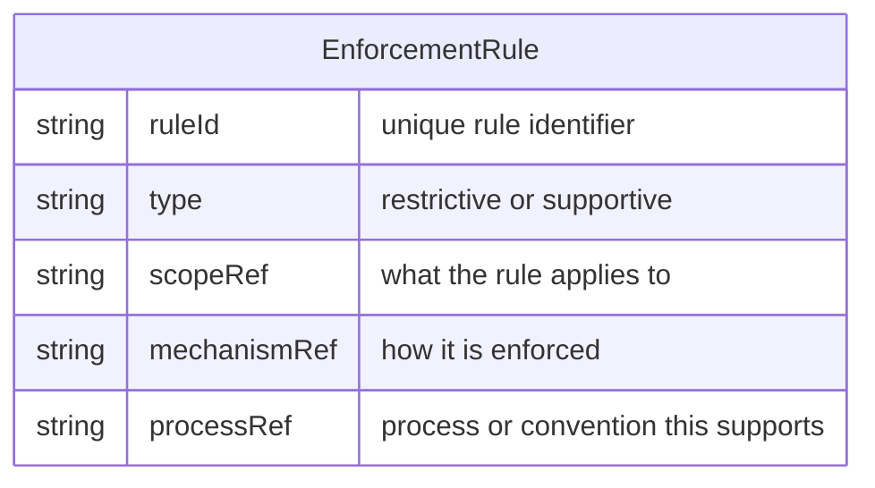

# Process Enforcement and Automation of Rules

## Purpose

Ensure that [Process](../entities/Entity%20-%20Process.md)es are reliably deployed into the environment where work is done: not only documented, but checked, reviewed, and enforced. Automation removes human error from defined processes by introducing tool settings, configurations, or dedicated tools (e.g. branch protection, naming checks, safeguards against destructive actions). [Business Rule](../entities/Entity%20-%20Business%20Rule.md)s are applied in two ways: **restrictive** (block actions that break the rules, e.g. prevent deleting a critical repository or committing without following conventions) and **supportive** (defaults, auto-selection, or automatic behaviour that [People](../entities/Entity%20-%20Person.md) can override when there are legitimate exceptions). Outcome: processes are consistently followed and key rules are enforced with minimal reliance on memory or discipline alone.

## Conditions

This process is doable only when:

- One or more [Process](../entities/Entity%20-%20Process.md)es are defined (e.g. as process notes in `processes/`) and there is an environment in which they run (repositories, [Project](../entities/Entity%20-%20Project.md)s, tooling).
- You have the ability to change configurations, settings, or automation in that environment (e.g. branch protection, CI checks, IDE or editor settings, work-tracking automation).
- Optionally: a [Team](../entities/Entity%20-%20Team.md) or set of [People](../entities/Entity%20-%20Person.md) is in context so that enforcement and supportive rules can be scoped to the right users and workflows.

## Tools

Tools depend on the process and environment. Typically they include:

- Version control (e.g. Git) for branch protection, hooks, and policy enforcement.
- CI/CD or build pipelines for automated checks (lint, tests, conventions).
- IDE or editor settings and configs (e.g. formatters, lint rules) to enforce conventions and supportive defaults.
- Work-tracking systems such as [JIRA](../tools/Tool%20-%20JIRA.md) for automation (e.g. required fields, transitions, default assignees).

## Data Model

Enforcement and automation can be described in terms of [Business Rule](../entities/Entity%20-%20Business%20Rule.md)s that apply to a process or environment:

- **Rule type**: restrictive (stops an action) or supportive (defaults or auto-behaviour that can be overridden).
- **Scope**: what the rule applies to (e.g. repository, branch, ticket type, role).
- **Mechanism**: how it is enforced (e.g. Git hook, CI job, tool setting, JIRA automation).

The schema below aligns with the [Business Rule](../entities/Entity%20-%20Business%20Rule.md) entity.

### Rule schema

## Process

1. **Identify processes to enforce.** List the [Process](../entities/Entity%20-%20Process.md)es (or conventions) that should be reliably followed in the environment. Include any that are currently “documented only” and rely on people remembering or choosing to follow them.

2. **Decide what to automate vs review.** For each process, decide which elements can be automated (settings, configs, tools) to remove human error, and which remain as manual checks or reviews. Prefer automation for repetitive, rule-based steps (e.g. naming, required fields, branch protection); keep review where judgment or context is needed.

3. **Define restrictive rules.** For actions that must not happen (e.g. force-push to main, deleting a key repo, skipping required fields), define restrictive [Business Rule](../entities/Entity%20-%20Business%20Rule.md)s and implement them so the tool or pipeline blocks the action or flags it before it is applied.

4. **Define supportive rules.** For behaviours that should usually happen but may have exceptions (e.g. default assignee, default branch, auto-formatting), define supportive [Business Rule](../entities/Entity%20-%20Business%20Rule.md)s: defaults or auto-behaviour that [Person](../entities/Entity%20-%20Person.md) can override when appropriate.

5. **Implement in the environment.** Apply the [Business Rule](../entities/Entity%20-%20Business%20Rule.md)s using the available tools: branch protection, hooks, CI jobs, IDE/config settings, JIRA (or similar) automation. Document where each rule is implemented so it can be maintained and updated.

6. **Include in the meta process.** Treat “check, review, and enforce” as part of an ongoing meta process: periodically verify that automation and enforcement are still in place, that they match the current process notes, and that new processes or changes get corresponding [Business Rule](../entities/Entity%20-%20Business%20Rule.md)s and automation where appropriate.
