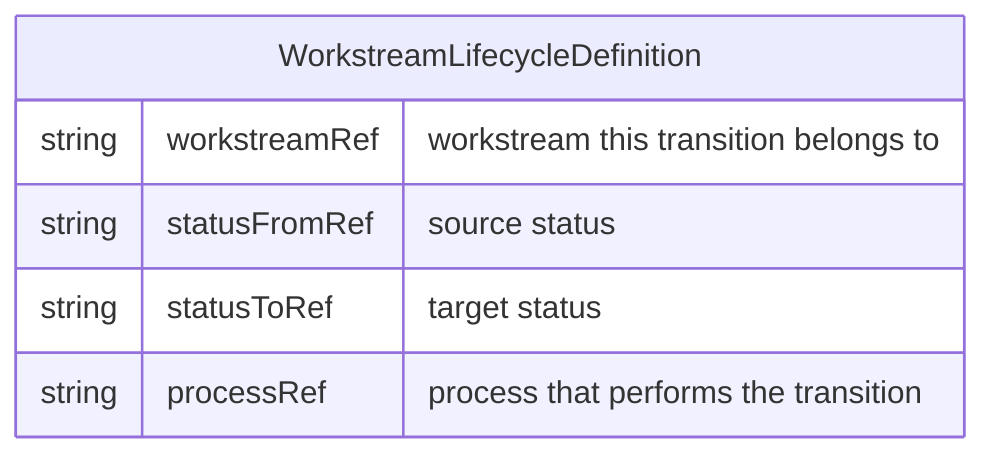

# Workstream Lifecycle Definition

## Purpose

Define the lifecycle of [Work](../entities/Entity%20-%20Work.md) within a [Workstream](../entities/Entity%20-%20Workstream.md): identify sources of work (where work items are spawned), the statuses work moves through, and the [Process](../entities/Entity%20-%20Process.md) that performs each transition. Examples of sources include: architectural definition of what needs to be developed; QA testing that picks up issues or deviations from what was built vs what was required; UAT requests due to expectations not met by documented requirements or other causes. The output is a status-transition table and associated processes.

## Conditions

This process is doable only when:

- You are defining or operating a [Workstream](../entities/Entity%20-%20Workstream.md).
- Optionally: a [Project](../entities/Entity%20-%20Project.md) and [Team](../entities/Entity%20-%20Team.md) are in context so the workstream can be scoped and assignable [People](../entities/Entity%20-%20Person.md) are known.

## Tools

- [JIRA](../tools/Tool%20-%20JIRA.md) (or similar) for tracking work status, if the lifecycle is applied in a tool; otherwise this is a definition-only process with no tools required.

## Data Model

- The lifecycle is defined by a **status transition table**: one row per allowed transition for a [Workstream](../entities/Entity%20-%20Workstream.md).
- Each row has: source status, target status, and the [Process](../entities/Entity%20-%20Process.md) that performs the transition (and, in the schema, a workstream reference).
- The table below is an example flow for a typical development workstream (company may extend or simplify).

| Status From   | Status To   | Process                                  |
| ------------- | ----------- | ---------------------------------------- |
| Does Not Exist | To Do       | Work Definition                          |
| To Do         | In Progress | Work Assignment                          |
| In Progress   | Dev Ready   | PR Submission (w.r.t Branching Strategy) |
| Dev Ready     | Dev Testing | Merging PR to `dev`                      |
| Dev Testing   | QA Ready    | Dev Sign-off / Handover to QA            |
| QA Ready      | QA Testing  | QA Execution                             |
| QA Testing    | UAT Ready   | QA Sign-off / Merge to UAT               |
| UAT Ready     | In UAT      | UAT Assignment                           |
| In UAT        | Done        | UAT Sign-off / Acceptance                |

### Workstream Lifecycle Definition schema

The table is defined by the following schema. Each row is one allowed transition, with references to the workstream, source status, target status, and the process that performs it.

## Process

1. **Identify sources of work.** Decide where work items for this [Workstream](../entities/Entity%20-%20Workstream.md) come from (e.g. architecture, QA findings, UAT requests).

2. **Define statuses.** List all statuses that [Work](../entities/Entity%20-%20Work.md) in this stream will typically pass through, in order. Some work types may skip statuses; the main flow should be linear. The company may define new [Process](../entities/Entity%20-%20Process.md)es and statuses as needed.

3. **Assign a process per transition.** For each transition from one status to the next, name the [Process](../entities/Entity%20-%20Process.md) that performs it. Create or link to process notes in `processes/` as needed.

4. **Document in the table.** Maintain the status-transition table (and Mermaid schema) so it stays the single source of truth for the lifecycle.
