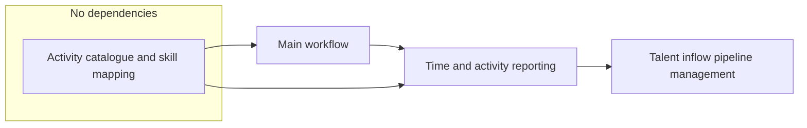

# Process dependency graph

Each process note states which other processes it depends on in a **Process dependencies** section. This document summarises the convention and provides a dependency graph for the time, activity, and talent pipeline processes.

## Convention

- In each process note, the **Process dependencies** section lists other processes this process depends on, using standard Markdown links to the process notes.
- If a process has no dependencies, it states "None."
- Dependencies indicate that the listed process(es) must be in place or their outputs available for this process to be doable (e.g. time entries must exist before reporting on them).

## Dependency graph (time, activity, reporting, talent pipeline)

- **Activity catalogue and skill mapping** has no dependencies; it can be run first to create the activity and skill lists and mapping.
- **Main workflow** depends on Activity catalogue and skill mapping (activities must exist to classify time).
- **Time and activity reporting** depends on Main workflow (needs time entries); optionally on Activity catalogue and skill mapping (for skill-level insights).
- **Talent inflow pipeline management** depends on Time and activity reporting (capacity and activity concentration); optionally on Activity catalogue and skill mapping (skill demand).

Update this graph when new processes are added or dependencies change.
