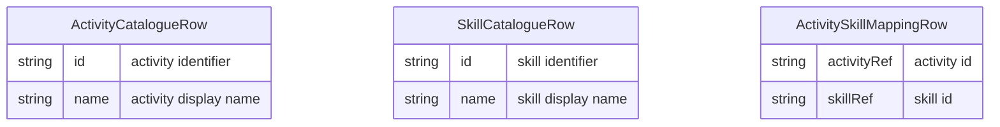

# Activity Catalogue and Skill Mapping

## Purpose

Maintain an **activity catalogue** ([Activity](../../entities/activity.md)) and **map activities to [Skill](../../entities/skill.md)s** so that activity concentration (from time and activity reporting) can be translated into skills in demand, feeding actionable insights into talent pipeline management. Outcome: a maintained set of activities and activity–skill mappings that time tracking and reporting processes can use.

## Conditions

This process is doable only when:

- There is clear ownership of the activity catalogue (e.g. a [Role](../../entities/role.md) or [Team](../../entities/team.md)).
- There is agreement on what counts as an [Activity](../../entities/activity.md) and how it maps to [Skill](../../entities/skill.md)s.

## Tools

- [Excel](../../tools/Tool%20-%20Microsoft%20Excel.md) (or similar) for storing the activity list, skill list, and activity–skill mapping. Optionally a wiki or dedicated tool if the company adopts one.

## Data Model

The catalogue comprises:

- A list of [Activity](../../entities/activity.md) records (id, name).
- A list of [Skill](../../entities/skill.md) records (id, name).
- An [Activity–Skill](../../entities/activity-skill.md) mapping table: each row links one activity to one skill (many-to-many).

## Process

1. **Define or review activities.** List the [Activity](../../entities/activity.md) types the company uses for time classification (e.g. development, code review, QA, design). Add or update the activity list in the chosen tool.

2. **Define or review skills.** List the [Skill](../../entities/skill.md)s relevant to capacity and talent (e.g. technologies, disciplines). Add or update the skill list.

3. **Map each activity to one or more skills.** For each [Activity](../../entities/activity.md), record which [Skill](../../entities/skill.md)s it requires or utilises in the [Activity–Skill](../../entities/activity-skill.md) mapping table.

4. **Publish or update.** Make the catalogue and mapping available so personal time and task management (and time and activity reporting) can use them.

## Process dependencies

None.
