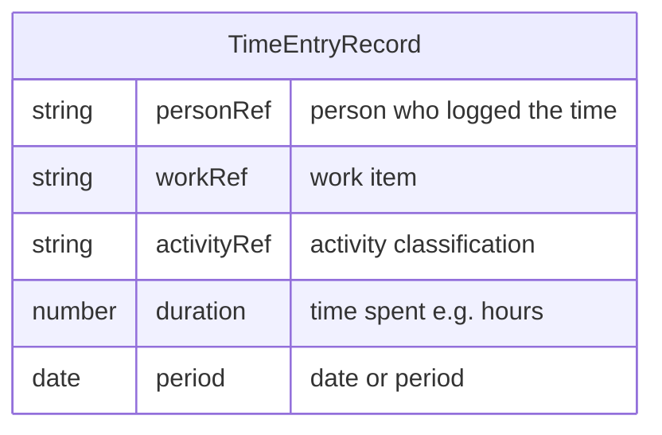

# Personal Time and Task Management

## Purpose

Define how a [Person](../../entities/person.md) tracks their **time against [Work](../../entities/work.md)** and classifies that work (or each segment of time) against an [Activity](../../entities/activity.md) so that time and activity data exist for reporting and talent insights. Outcome: consistent [Time Entry](../../entities/time-entry.md) data for capacity and activity concentration reporting.

## Conditions

This process is doable only when:

- A [Person](../../entities/person.md) is in context (the person logging time).
- [Work](../../entities/work.md) (e.g. [Ticket](../../entities/ticket.md)s) is available to log against.
- An [Activity](../../entities/activity.md) catalogue exists so the person can choose an activity classification (see Process dependencies).

## Tools

- [JIRA](../../tools/Tool%20-%20JIRA.md) for time logging against work items, if the company uses JIRA for time tracking; and/or [Excel](../../tools/Tool%20-%20Microsoft%20Excel.md) (or a dedicated time-tracking tool) for capturing time and activity if not in JIRA.

## Data Model

Each [Time Entry](../../entities/time-entry.md) records: who ([Person](../../entities/person.md)), which [Work](../../entities/work.md), which [Activity](../../entities/activity.md), duration, and period (e.g. date).

## Process

1. **Select work item.** Choose the [Work](../../entities/work.md) (e.g. ticket) to log time against.

2. **Log time and duration.** Record how much time was spent (e.g. hours).

3. **Assign activity classification.** Select the [Activity](../../entities/activity.md) that best describes how the time was spent (e.g. development, code review).

4. **Submit or save.** Store the [Time Entry](../../entities/time-entry.md) in the chosen tool. Repeat as needed for other work items or periods.

## Process dependencies

- [Activity Catalogue and Skill Mapping](./activity-catalogue-and-skill-mapping.md) — so a list of [Activity](../../entities/activity.md) types exists to choose from when classifying time.
