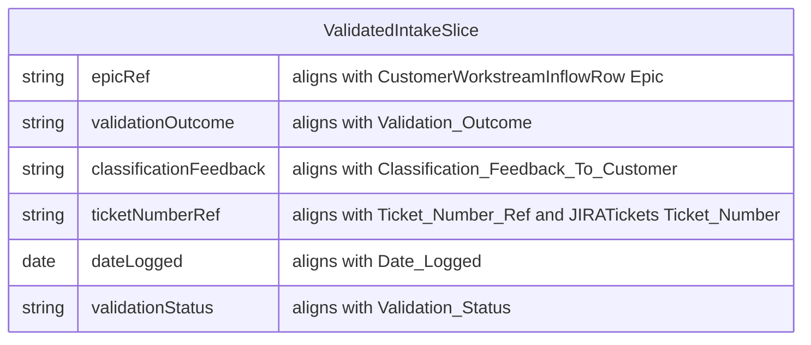

# Customer-facing workstream inflow validation workflow

## Purpose

Act as a **buffer between the customer and the teams that deliver work** by interpreting **customer-provided issue lists**, deciding **validity and Epic placement**, and producing two concrete outputs: **(a)** **classification feedback to the customer** (how each line was interpreted—classification, Epic, and whether it is accepted as work, deferred, or rejected with rationale); **(b)** **JIRA linkage for genuine work**—**as far as practical, avoid duplicate tickets** by **searching for existing issues** that already resolve or cover the customer’s need before creating a new issue, and by **merging multiple customer lines into a single new ticket** when they describe the same underlying work. Issue keys (**new or existing**, **one ticket may cover several lines**) are recorded on the intake row(s). **State touched** (intake rows, JIRA reads/creates/links, customer communications) is summarized under **Data Model**.

Downstream, [Workstream inflow ticket grooming workflow](./workstream-inflow-ticket-grooming-workflow.md) **consumes** tickets that exist after this process (typically keyed on **`Ticket_Number_Ref`** in the canonical intake schema); reporting elsewhere (for example [Workstream ticket update workflow](./workstream-ticket-update-workflow.md)) consumes **`JIRATickets`** once synced.

## Conditions

This workflow is doable only when:

- A [Project](../../entities/project.md) or [Epic](../../entities/epic.md) scope is clear and an **intake owner** is identified (often the Epic **SPOC**—one accountable [Person](../../entities/person.md) for customer-facing inflow on that Epic).
- The **customer intake channel** is agreed (for example email, shared spreadsheet, or [Teams](../../tools/Tool%20-%20Microsoft%20Teams.md)).
- The intake owner can access **customer communication** paths and **[JIRA](../../tools/Tool%20-%20JIRA.md)** to **search**, **create**, and **link** issues to the right Epic.
- **Classification and status vocabulary** for the workstream align with [Workstream Lifecycle Definition](../workstream-lifecycle-definition.md) so feedback to the customer and logged tickets use shared terms where applicable.
- There is enough context to distinguish **duplicate, invalid, or out-of-scope** lines from **accepted work**, and to draft **customer-safe** feedback text.

## Tools

- [JIRA](../../tools/Tool%20-%20JIRA.md) — Search the backlog and board for **existing issues** that already address the customer’s need; **create** new issues only when no suitable issue exists; **link** accepted work to the **Epic**; use fields your project uses for classification and description. Prefer **one ticket per distinct piece of work**, with **multiple intake rows** pointing to the **same** issue key when merged.
- [Excel](../../tools/Tool%20-%20Microsoft%20Excel.md) or another **intake list** tool — Optional; if the customer list is maintained as a table, column names can follow **`CustomerWorkstreamInflowRow`** in [../../data/customer-workstream-inflow.md](../../data/customer-workstream-inflow.md).
- [Teams](../../tools/Tool%20-%20Microsoft%20Teams.md) or email — **Customer-facing** delivery of classification feedback when that is the agreed channel.

## Impact

- **Customer transparency** — The customer receives explicit **classification feedback** (including Epic assignment and acceptance decisions), not only silent internal triage.
- **Traceability** — Each line can be traced from **customer text → feedback → `Ticket_Number_Ref`** when work is logged.
- **Noise reduction** — Internal delivery teams see **JIRA issues** for real work, with non-work lines filtered or documented with rationale in **`Classification_Feedback_To_Customer`**.
- **Duplicate control** — Fewer redundant tickets by **reusing existing issues** where they already solve the problem and by **consolidating** several customer lines into **one** ticket when they are the same issue.
- **Alignment** — Classification and Epic routing match shared vocabulary from [Workstream Lifecycle Definition](../workstream-lifecycle-definition.md), reducing mis-routed work.

## Cost

**Runtime (typical instance):** often **minutes to several hours** per batch, driven by **line count**, how clear the customer descriptions are, **JIRA search and deduplication effort**, **back-and-forth** with the customer, and how many lines require **new** JIRA issues versus **linking to existing** ones. **Cadence** follows customer intake events (for example weekly lists or ad hoc drops). Variance is high when many lines are ambiguous, duplicate, or require cross-checking a large backlog.

## Skills required

Capabilities the running agent (intake owner or SPOC) needs:

- **Intake triage** — Distinguish genuine issues from duplicates, invalid items, or out-of-scope requests; **search JIRA** to find **existing tickets** that already resolve or track the work before proposing a new issue.
- **Consolidation** — Recognize when **several customer lines** describe the **same** underlying issue and merge them into **one** ticket (new or existing), with clear feedback tying each customer line to that shared key.
- **Customer-facing communication** — Write **classification feedback** that is accurate, respectful, and aligned with team policy.
- **Lifecycle-aware classification** — Map lines to Epic and work types per [Workstream Lifecycle Definition](../workstream-lifecycle-definition.md) and Epic-specific rules.
- **JIRA search, create, and link** — Search before creating; **create** correctly linked issues only when no suitable issue exists; **attach** the same key to **every** merged intake row; link [Skill](../../entities/skill.md) when a named skill note exists.

## Data Model

### Customer communication versus internal ticket records

| Artifact | Role |
| -------- | ---- |
| **Intake row** (`CustomerWorkstreamInflowRow`) | **Read:** customer-supplied fields; **write:** `Epic`, `Classification`, `Validation_Status`, `Validation_Outcome`, **`Classification_Feedback_To_Customer`**, **`Ticket_Number_Ref`**, **`Date_Logged`**, ownership and dates as used by your list. **Several rows** may share the **same** **`Ticket_Number_Ref`** when multiple customer lines are **merged** into one ticket. |
| **Customer message** | **Write:** send or post the agreed **classification feedback** (can mirror or summarize `Classification_Feedback_To_Customer` per line or batch). When lines are merged or satisfied by an **existing** ticket, say so explicitly in the feedback for each affected line. |
| **JIRA issue** | **Read:** search and open **existing** issues that already address the need; **write:** **create** a new issue only when needed; otherwise **link** intake rows to the **existing** issue key. **Read** back the key (new or existing) into **`Ticket_Number_Ref`** on each row that shares that work item. |

Canonical column definitions for the intake table are in [../../data/customer-workstream-inflow.md](../../data/customer-workstream-inflow.md). **`Ticket_Number_Ref`** holds the **authoritative JIRA key** for the work item—whether **newly created** or **pre-existing**—and aligns with **`Ticket_Number`** on **`JIRATickets`** in [../../data/work-items.md](../../data/work-items.md) once synced.

### Fields this process typically touches

Validation focuses on **disposition**, **customer feedback text**, and **ticket linkage**; not every intake column must change every run.

## Process

1. **Confirm scope and ownership.** Verify the [Epic](../../entities/epic.md) or [Project](../../entities/project.md) in scope and that you are the **intake owner** accountable for this batch.

2. **Ingest the customer list.** Load or import lines into a structure consistent with **`CustomerWorkstreamInflowRow`** (see [../../data/customer-workstream-inflow.md](../../data/customer-workstream-inflow.md)); preserve **`Line_Number`** and customer text fields.

3. **Triage each line and group related work.** For each row, decide **validity**, **Epic**, and **internal classification** (Enhancement, Bug, Defect, Task, or team vocabulary) per [Workstream Lifecycle Definition](../workstream-lifecycle-definition.md) and Epic rules. **Across the batch**, identify customer lines that are **the same underlying issue** so they can share **one** ticket later.

4. **Search JIRA for existing coverage.** Before creating anything new, **search** the relevant Epics/projects in [JIRA](../../tools/Tool%20-%20JIRA.md) for issues that **already resolve**, **track**, or **duplicate** the customer’s request. If a match is sufficient, plan to **reference that issue key** rather than open a redundant ticket; update or comment on the existing issue if your team’s policy requires extra context from the customer list.

5. **Set `Validation_Outcome`.** Record whether the line is **accepted-as-work** (new or existing ticket), **duplicate-of-existing** (covered by an issue you will reference), **invalid**, **out-of-scope**, **needs-more-info**, or other agreed values.

6. **Draft `Classification_Feedback_To_Customer`.** For **every** line, write text the customer can receive: confirmed or adjusted classification, Epic, and—if not accepted—**clear rationale**. For accepted or duplicate-of-existing lines, name the **JIRA key** (existing or new) and, when **multiple lines map to one ticket**, state that **those lines are tracked together** on that key.

7. **Create or link JIRA tickets for genuine work.** For each **distinct** work item (after **merging** lines and **reusing** existing issues): either **record the existing issue key** on every intake row that maps to it, or **create one new issue** (Epic linked, summary/description covering **merged** scope where applicable) and record **`Ticket_Number_Ref`** on **all** rows that share that work. Set **`Date_Logged`** when the key is first attached (new create) or when the row is linked to an existing issue in this run, per your team’s convention.

8. **Deliver customer feedback.** Send or post **classification feedback** through the agreed channel ([Teams](../../tools/Tool%20-%20Microsoft%20Teams.md), email, or customer portal). Order may be **batch after** linking or creating tickets for accepted lines, or **per-line** as your team agrees; the **complete** run includes **both** feedback delivery and **`Ticket_Number_Ref`** populated where work is tracked (new or existing).

9. **Hand off to grooming.** For rows with **`Ticket_Number_Ref`** populated, [Workstream inflow ticket grooming workflow](./workstream-inflow-ticket-grooming-workflow.md) applies to the **JIRA tickets** (status, assignee, comments) as usual.

## Process dependencies

- [Workstream Lifecycle Definition](../workstream-lifecycle-definition.md) — Shared **status and classification vocabulary** for feedback and ticket fields.
