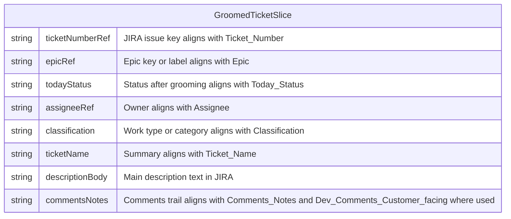

# Workstream inflow ticket grooming workflow

## Purpose

Ensure **new work entering an [Epic](../../entities/epic.md)** is **triaged in JIRA** so every in-scope ticket is **assigned**, **categorized**, and **contextualized** before other workflows depend on it. The **single point of contact (SPOC)** for the Epic runs this process so inflow matches that Epic’s agreed rules and the [Workstream Lifecycle Definition](../workstream-lifecycle-definition.md). **State touched** (JIRA fields and ticket records) is summarized under **Data Model**.

Epic- or workstream-specific **inflow** rules (what counts as “new,” which statuses apply first, who may own which transition) sit **alongside** the lifecycle definition; grooming actions must respect both without duplicating full lifecycle tables in this note.

Reporting and status visibility elsewhere (for example [Workstream ticket update workflow](./workstream-ticket-update-workflow.md)) **consume** groomed tickets but are not prerequisites for running this process.

## Conditions

This workflow is doable only when:

- An [Epic](../../entities/epic.md) is in scope and its **SPOC** is identified (one accountable [Person](../../entities/person.md) for inflow on that Epic).
- **Inflow** expectations for that Epic are known: which [Ticket](../../entities/ticket.md) types or sources count as inflow, and how they map to statuses per [Workstream Lifecycle Definition](../workstream-lifecycle-definition.md) plus any Epic-specific notes.
- The SPOC can access [JIRA](../../tools/Tool%20-%20JIRA.md) and can see **assignable people** and roles for the relevant [Team](../../entities/team.md) or project.
- There is enough context to distinguish **information already supplied by reporters** from **information the SPOC must add** during grooming (status moves, description edits, comments, assignment).

## Tools

- [JIRA](../../tools/Tool%20-%20JIRA.md) — Authoritative record for tickets: status, description, comments, assignee, Epic link, and categorization fields your project uses.

## Impact

- **Handoff quality** — Downstream roles receive tickets with clear ownership and enough context to start work without re-discovering basics.
- **Alignment** — Status and assignment match the shared lifecycle vocabulary in [Workstream Lifecycle Definition](../workstream-lifecycle-definition.md), reducing thrash and mis-routed work.
- **Operational visibility** — Groomed tickets feed consistent reporting and steering (including [Workstream ticket update workflow](./workstream-ticket-update-workflow.md)) once data is synced to external tables or reports.
- **Risk reduction** — Unowned or ambiguous inflow items are surfaced and resolved before they stall the Epic.

## Cost

**Runtime (typical instance):** often **minutes to a few hours** per grooming pass, driven by **inflow volume**, how complete reporter tickets are, and how much clarification is needed. **Cadence** is usually daily or several times per week while the Epic accepts new work; spikes follow large intake events. Variance is high when inflow is poorly specified or when team capacity for assignment is unclear.

## Skills required

Capabilities the running agent (the Epic SPOC) needs:

- **JIRA hygiene** — Status, description, comments, assignee, and Epic linkage kept accurate and traceable.
- **Lifecycle-aware triage** — Map tickets to the correct first or next status per [Workstream Lifecycle Definition](../workstream-lifecycle-definition.md) and Epic-specific inflow rules.
- **Assignment judgment** — Match work to the right person or role given skills and **current team capacity**.
- **Stakeholder communication** — Short, clear comments when reporters must supply missing information.

## Data Model

### Inputs and outputs

| Direction | Description |
| --------- | ----------- |
| **Read** | [Ticket](../../entities/ticket.md) records in JIRA linked to the Epic; reporter fields; current status and assignee; team roster or capacity signals the SPOC uses. |
| **Write** | Same tickets after grooming: updated **status**, **description**, **comments**, **assignee**, and **classification** fields (e.g. issue type, labels, components) as defined for the Epic. |

Canonical field names for Excel or reporting alignment with other workflows match the **`JIRATickets`** logical schema in [../../data/work-items.md](../../data/work-items.md) (for example `Ticket_Number`, `Epic`, `Today_Status`, `Assignee`, `Classification`, `Ticket_Name`, `Comments_Notes`).

### Fields this process typically touches

Grooming does not require every column in `JIRATickets`; it focuses on moving tickets from **ambiguous or default inflow** to a **ready-for-work** shape for the next process.

## Process

1. **Confirm scope and ownership.** Verify the [Epic](../../entities/epic.md) in scope and that you are the **SPOC** accountable for its inflow for this pass.

2. **List inflow tickets.** Using Epic-specific rules and JIRA views or filters, collect **new or ungroomed** tickets that belong to this inflow (for example recently created, default status, or an agreed “needs triage” slice).

3. **Check reporter-supplied information.** For each ticket, decide whether the **minimum** context is present (what was requested, expected outcome, constraints). If not, **comment** on the ticket and notify the reporter or channel as your team does; pause or park the ticket per Epic rules until clarified.

4. **Set or correct status.** Move the ticket to the appropriate status per [Workstream Lifecycle Definition](../workstream-lifecycle-definition.md) and any **Epic-specific inflow** rules (first valid state for work to start, or next state if the ticket was mis-filed).

5. **Enrich description and comments.** Add or tighten **description** text and **comments** so the next owner understands scope, acceptance, and handoff notes without duplicating the whole lifecycle definition.

6. **Categorize and assign.** Set **classification** (or labels/components) as required by the Epic, then **assign** to the [Person](../../entities/person.md) or role best placed to act, consistent with team capacity and the lifecycle stage.

7. **Complete the pass.** The workflow is **complete for this run** when all **targeted inflow tickets** in scope are **assigned**, **categorized**, and **contextualized** so other processes (including execution work and [Workstream ticket update workflow](./workstream-ticket-update-workflow.md)) can rely on them.

## Process dependencies

- [Customer-facing workstream inflow validation workflow](./customer-facing-workstream-inflow-validation-workflow.md) — When inflow originates from a **customer-provided list**, issues should exist only after **classification feedback** and **ticket logging** for accepted work; grooming then applies to those JIRA tickets.
- [Workstream Lifecycle Definition](../workstream-lifecycle-definition.md) — Provides status semantics and transition intent; Epic-specific inflow rules extend but do not replace alignment with this definition.
