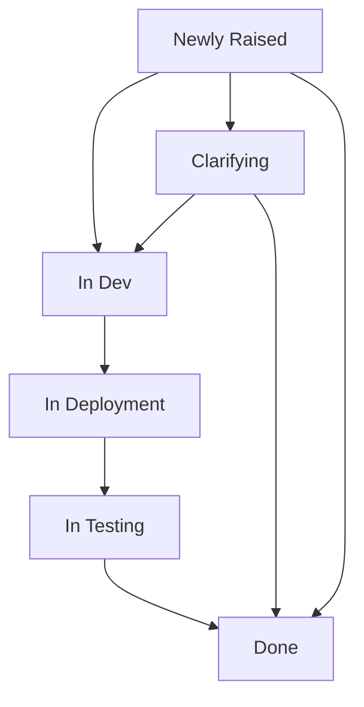
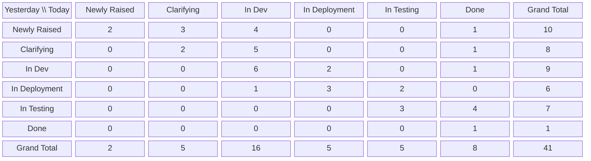
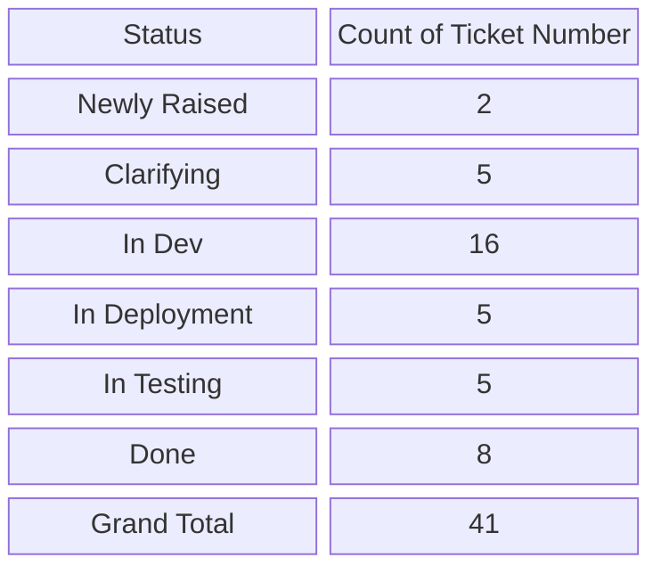

# Workstream ticket update workflow

## Purpose

Maintain a current operational view of ticket progress across all active [Epics](../../entities/epic.md) in a project by syncing JIRA ticket data into an external Excel work-item table, refreshing reporting pivots, and sending a standardized team email update. This workflow produces a repeatable communication output with transitional movement, snapshot counts, and targeted ticket-group slices.

## Conditions

This workflow is doable only when:

- A [Project](../../entities/project.md) is in scope and active Epics are known.
- Agents running the workflow can access [JIRA](../../tools/Tool%20-%20JIRA.md) and the external Excel workbook.
- The Excel workbook has a maintained work-item table with the schema in this workflow.
- Teams agree on status-group mappings for reporting, aligned to [Workstream Lifecycle Definition](../workstream-lifecycle-definition.md).
- An email distribution list (or recipients) exists for the final communication.

## Tools

- [JIRA](../../tools/Tool%20-%20JIRA.md) - Source of ticket fields and status updates.
- [Excel](../../tools/Tool%20-%20Microsoft%20Excel.md) - Work-item table, filters, Pivot Tables, and export-ready views.
- [Teams](../../tools/Tool%20-%20Microsoft%20Teams.md) or email client - Communication channel for clarifications and final output.

## Impact

- Keeps ticket status visibility synchronized between JIRA and Excel for all active Epics.
- Produces a consistent daily/periodic reporting package for delivery teams and stakeholders.
- Reduces status drift by explicitly capturing `Today Status` and `Yesterday Status`.
- Improves handoff quality through one final, structured email communication.

## Cost

Runtime per reporting cycle is usually 30-120 minutes depending on active Epic count, ticket volume, and the amount of manual cleanup needed in source ticket data. Extra time may be needed when status mappings change or if ticket groups are redefined for a specific workstream.

## Skills required

- JIRA data review and reconciliation.
- Excel table maintenance, filtering, and Pivot Table refresh.
- Lifecycle-aware status mapping (per [Workstream Lifecycle Definition](../workstream-lifecycle-definition.md)).
- Clear written communication for stakeholder updates.

## Data Model

The external Excel work-item table uses the canonical `JIRATickets` schema in [../../data/work-items.md](../../data/work-items.md). That file is the source of truth and includes datatype, field name, and description for every field.

## Reports and communication outputs

### Example high-level status flow

This is a high-level example only. Actual status flow and grouping can differ by Epic, and should align with [Workstream Lifecycle Definition](../workstream-lifecycle-definition.md).

### Pivot report 1: Transitional View of Tickets

- Purpose: show movement from `Yesterday Status` to `Today Status`.
- Suggested pivot layout:
  - Rows: `Yesterday Status`
  - Columns: `Today Status`
  - Values: Count of `Ticket Number`
  - Filters: `Epic` (active only), optional `Priority`, optional `Assignee`

Example interpretation:

- `Newly Raised` to `In Dev` = `4` means 4 tickets entered active development quickly.
- `In Deployment` to `In Testing` = `2` means 2 tickets progressed from deployment to testing today.
- `In Testing` to `Done` = `4` means 4 tickets completed from testing since yesterday.
- Right-side `Grand Total` for each row (for example, `Clarifying` row total `8`) means how many tickets were in that **yesterday** status before movement.
- Bottom `Grand Total` for each column (for example, `In Dev` column total `16`) means how many tickets ended in that **today** status after movement.
- The bottom-right overall `Grand Total` (`41`) is the full count of in-scope tickets; it should match both the sum of row totals and the sum of column totals.
- Practical read: use row totals to understand **where work came from** (starting distribution), and column totals to understand **where work now is** (current distribution).

### Pivot report 2: Snapshot View of Tickets

- Purpose: show current status counts for active Epics at the reporting timestamp.
- Suggested pivot layout:
  - Rows: `Today Status`
  - Values: Count of `Ticket Number`
  - Filter: `Epic` (active only)

### Ticket Groups

Ticket groups are configurable and may differ by Epic/workstream. Group definitions should be mapped to statuses from [Workstream Lifecycle Definition](../workstream-lifecycle-definition.md).

Examples of practical ticket groups that signal work required by other team members:

- **Tickets to Deploy**: filter for statuses that represent deploy readiness or deployment queue for the relevant lifecycle.
- **Tickets in Progress**: filter prioritized tickets in active execution statuses (for example, in-progress design/dev/testing states).
- **Tickets in Testing**: filter for statuses that represent retesting required.
- Additional groups can be introduced per workstream as needed, as long as group logic is explicit in the reporting cycle notes.

## Process

1. **Define active scope.** Confirm the active Epics in scope and reporting timestamp.
2. **Pull current ticket data from JIRA.** Export or query all in-scope ticket fields needed by the Excel schema.
3. **Update Excel table.** Reconcile rows by `Ticket Number` and update fields in the schema, especially `Today Status`, `Yesterday Status`, `Updated`, ownership fields, and dates.
4. **Validate table integrity.** Check for missing ticket keys, duplicate keys, and invalid status values before reporting.
5. **Refresh Transitional pivot.** Refresh Pivot Table for movement from `Yesterday Status` to `Today Status`.
6. **Refresh Snapshot pivot.** Refresh Pivot Table for current status counts.
7. **Prepare Ticket Groups views.** Apply agreed lifecycle-aware filters to produce group slices (for example, Tickets to Deploy and Tickets in Progress).
8. **Build final email communication.** Send one structured update in this exact order:
   9. Transitional View of Tickets (pivot table) - only exclude on first communication within the [Project](../../entities/project.md) as there is no `Yesterday Status` on any tickets.
   10. Snapshot View of Tickets (pivot table)
   11. Ticket Groups (with one subsection per configured group)
12. **Record run metadata.** Capture as-of timestamp, Epic scope, and any caveats or data quality notes in the email body or run log.

## Process dependencies

- [Workstream Lifecycle Definition](../workstream-lifecycle-definition.md) - Provides status semantics and grouping logic used by pivots and ticket groups.
