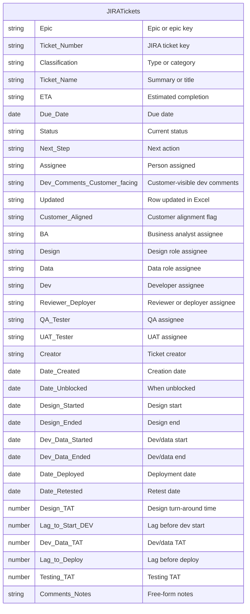
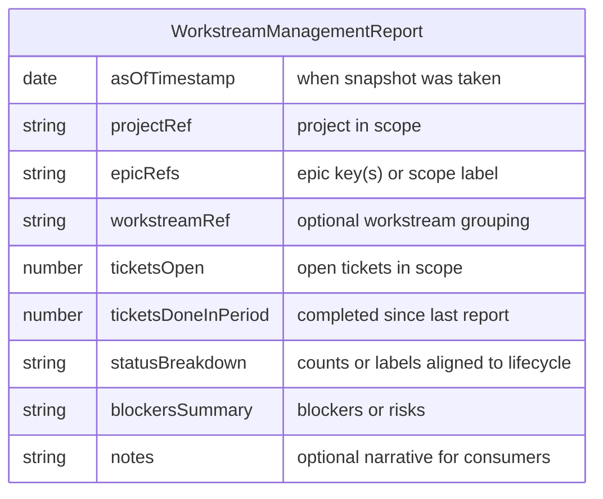

# Workstream management

## Purpose

Manage work at [Workstream](../entities/workstream.md) or [Epic](../entities/epic.md) granularity on a **periodic** cadence. This process combines two complementary outcomes:

1. **Operational alignment** — Keep JIRA [Tickets](../entities/ticket.md) and the project’s Excel **JIRATickets** table in sync: capture new tickets, assign them to [People](../entities/person.md) on the [Team](../entities/team.md), update JIRA and Excel, and keep assignees informed. Same idea as the former “Periodic Work Management - Task Updates & Alignment across Workers” workflow.

2. **Steering and visibility** — Produce an **inspectable report** (logical schema below) for leadership and cross-team alignment, using JIRA-native views, a rollup from the Excel model, or an export / automation pipeline (e.g. database + n8n).

Lifecycle semantics (status names and transitions) come from [Workstream lifecycle definition](./workstream-lifecycle-definition.md); this process does not replace that definition. **State touched** (records read and written) is specified under **Data Model**.

## Conditions

This process is doable only when:

- A [Project](../entities/project.md) exists in context.
- A [Team](../entities/team.md) exists: [People](../entities/person.md) who are [Assignable](../entities/assignment.md) within the [Epics](../entities/epic.md) in scope.
- Scope is clear: one or more Epics (or an agreed slice of a Workstream) whose Tickets live in JIRA.
- People running the process have access to the relevant JIRA data.

**Excel operating model (Part 1):**

- [Excel](../tools/Tool%20-%20Microsoft%20Excel.md) workbook with a `JIRA` sheet and `JIRATickets` table (see **Data Model**).
- [SharePoint](../tools/Tool%20-%20Microsoft%20SharePoint.md) (or another agreed location) if the workbook is centrally hosted.
- [Teams](../tools/Tool%20-%20Microsoft%20Teams.md) (or equivalent) for coordination when the runbook expects it.

**Steering report (Part 2) — JIRA-native path:** Report layout, filter, dashboard, or app is chosen and recipients know where to look.

**Steering report (Part 2) — Export / automation path:** Export format, destination (e.g. database or file store), automation runtime (e.g. n8n), and delivery channel are agreed; failure alerting is defined at least informally.

## Tools

- [JIRA](../tools/Tool%20-%20JIRA.md) — Epics, Tickets, assignments, comments; may also host dashboards or reports.
- [Excel](../tools/Tool%20-%20Microsoft%20Excel.md) — `JIRATickets` table on the `JIRA` sheet when using the Excel operating model.
- [SharePoint](../tools/Tool%20-%20Microsoft%20SharePoint.md) — Central hosting of the workbook when used.
- [Teams](../tools/Tool%20-%20Microsoft%20Teams.md) — Team coordination during Part 1 when applicable.
- Optional (no tool note in this repo yet): **Database or file store**; **n8n** (or another workflow automation platform); **email or chat** for scheduled report distribution.

## Impact

- **Delivery team** — Assignments and ticket state stay current; fewer silent gaps between JIRA and the Excel operating model when Part 1 is used.
- **Leadership and cross-team alignment** — Steering consumers get a repeatable snapshot (counts, blockers, narrative) for prioritization and escalation without ad hoc status chasing.
- **Risk and quality** — Reduces duplicated work, missed new tickets, and misleading rollups when Excel and JIRA diverge or reports are not validated against source systems.

## Cost

**Runtime (typical instance):**

- **Part 1 (JIRA and Excel alignment), per Epic per run:** roughly **30–120 minutes**, driven by open ticket count, how many rows need field updates, and how much coordination (e.g. Teams) is required for new assignments.
- **Part 2 (steering report), per run:** roughly **15–60 minutes**, driven by reporting path (JIRA-native vs export/automation vs Excel rollup), scope breadth, and validation depth.
- **Combined** (Part 1 then Part 2 in one session): often **about 1–3 hours** for a mid-sized Epic on a weekly cadence; scale down if only Part 2 runs or JIRA-native views replace manual extraction.

Cadence is agreed per project (e.g. weekly); cost scales with Epic count if Part 1 is repeated per Epic.

## Skills required

Capabilities expected of the person or team running this process (mappable to [Skill](../entities/skill.md) notes as you add named skills to the repository):

- **Cross-system reconciliation** — Compare JIRA exports to `JIRATickets`, fix 1–1 row mapping, and keep fields consistent.
- **JIRA ticket administration** — Assign, transition, and comment in JIRA accurately.
- **Spreadsheet table work in Excel** — Maintain structured tables, filters, and row-level updates without breaking table integrity.
- **Written communication** — Clear JIRA comments and report notes (scope, as-of time, caveats) for assignees and consumers.
- **Aggregation and validation** — Build or check rollups (counts, status buckets) against source data; spot duplicates across Epics.
- **Operating rhythm** — Run on the agreed cadence so trends stay comparable.
- **Path selection** — Choose the lightest reporting path that still satisfies the audience (JIRA-native vs export vs Excel rollup).

## Data Model

### Excel: JIRATickets table

When using the Excel operating model:

- There should be 1–many [Epics](../entities/epic.md) on JIRA.
- There should be one sheet on Excel called `JIRA`.
- There should be one table on the `JIRA` sheet (e.g. `JIRATickets`).
- Each row in `JIRATickets` should be 1–1 with the Tickets in JIRA for the scoped work.
- One table can manage work items across all Epics within a Project.

The table on the `JIRA` sheet is defined by the following schema. Each row is one JIRA [Ticket](../entities/ticket.md).

Statuses in the `Status` column should align with [Workstream lifecycle definition](./workstream-lifecycle-definition.md) for the relevant Workstream.

### Steering report: WorkstreamManagementReport

**Inputs:** JIRA Epics and Tickets, and optionally the `JIRATickets` table as a reconciled view. Status labels in summaries must align with the lifecycle definition.

**Output:** each reporting run produces one logical report instance (fields below).

| Field idea | Description |
| ---------- | ----------- |
| As-of timestamp | When the snapshot was taken |
| Project / Epic scope | Keys or names covered |
| Workstream reference | If used for grouping |
| Ticket counts | Total open, done in period, by status bucket |
| Blockers / risks | Short text or linked ticket keys |
| Notes | Human commentary for leadership |

## Process

### Part 1. Periodic Epic and ticket alignment (JIRA and Excel)

Run this part when the team uses the centralized Excel workbook to mirror JIRA.

1. **Select Epic.** Choose a specific [Epic](../entities/epic.md) within the [Project](../entities/project.md) for this run.

2. **Check for new tickets.** If new [Tickets](../entities/ticket.md) may exist in JIRA: export from JIRA and use Excel to find ticket numbers that appear in JIRA but not yet in `JIRATickets`.

3. **Reconcile.** Ensure ticket counts match between Excel and JIRA. If there are new tickets: add rows to `JIRATickets` so there is a 1–1 mapping for this Epic.

4. **Filter out Done.** Exclude tickets that are done. (If a done ticket reopens, treat as exceptional and update Excel accordingly.)

5. **Set all `Updated` to False** for the rows you will touch this run.

6. **Update each ticket that is not done.** For each such ticket:
   - **If the JIRA ticket is new and unassigned:**
     1. Open the ticket from the Excel row link.
     2. Assign someone on the [Team](../entities/team.md).
     3. Comment on the ticket with context.
     4. Inform them personally of the ticket number.
     5. Update the Excel row with known fields (name, assignee, roles per [Role](../entities/role.md), etc.).
     6. Set `Updated` to True.
   - **Otherwise (existing ticket):**
     1. Open the ticket from Excel.
     2. Update changed fields so Excel matches JIRA; review as needed.
     3. If needed: gather dev comments, update JIRA, confirm the [Person](../entities/person.md) assignee is correct and aware.
     4. Set `Updated` to True.

### Part 2. Steering and visibility report

Run this part on the cadence needed for leadership (it can follow Part 1 in the same session or run independently if you only use JIRA-native reporting).

7. **Confirm scope and cadence.** Agree Project, Epics, or Workstream slice and the time window (e.g. since last report, current sprint).

8. **Extract ticket data.**
   - **JIRA-native path:** Saved filters, dashboards, or reports; document URLs so others can reproduce.
   - **Export / automation path:** Export fields via CSV, API, or integration; land in the agreed store if required.
   - **Excel rollup path:** Derive aggregates from `JIRATickets` after Part 1 is current.

9. **Transform to `WorkstreamManagementReport`.** Map counts, status buckets, and blockers; map JIRA statuses to lifecycle labels per [Workstream lifecycle definition](./workstream-lifecycle-definition.md).

10. **Validate.** Sanity-check totals against JIRA (or Excel); watch for duplicates across Epics.

11. **Publish or send.** Deliver to the audience (link, email, chat, wiki) with as-of timestamp and scope.

12. **Handle failures.** Log errors, notify owner, retry or publish a short “report skipped” notice.

## Process dependencies

- [Workstream lifecycle definition](./workstream-lifecycle-definition.md) — Status names in Excel, JIRA, and the steering report must stay consistent with the defined lifecycle for the Workstream.
